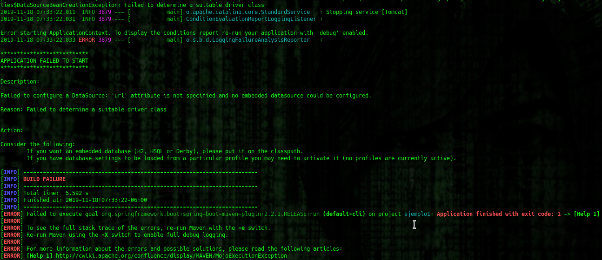

# Ejemplo 01

## Requisitos

- MySQL (o MariaDB) en el equipo y tener las credenciales de _root_
- IntelliJ IDEA Community Edition
- Apache Maven 3.8.4 o superior
- JDK (o OpenJDK)

## Objetivo 

- Hacer uso del Spring Data para configurar la conexión a la base de datos

## Preparativos

1. Clona el proyecto del ejemplo - [Código](codigo)

2. En la ruta **src/main/resouces/sql** se encuentran los archivos de inicialización de la base de datos. Ejecuta desde una línea de comandos:

```bash
  mysql -u root -p < usuario_y_esquema.sql
```
Esto creará el esquema (vacío) **BEDU_JSE2** y un par de usuarios: **usuario** y **admin** con contraseñas _PASSWD_ y _ADMIN_PWD_ respectivamente.

3. Ejecuta la siguiente instrucción (Nota que esta vez se ejecuta con el usuario admin que acabamos de crear)

```bash
  mysql -u admin -p < tablas.sql
```
Esto creará las tablas necesarias para el ejemplo.

<br/>

### Sobre Sprig Boot 

El ejemplo está hecho con Spring Boot, una herramienta de Spring que permite ejecutar una aplicación web sin un servidor de aplicaciones externo. El funcionamiento a profundidad de Spring Boot queda fuera del alcance de este curso, pero se recomienda su estudio. 

Se puede inicializar una aplicación de Spring Boot con Maven usando el siguiente comando

```bash
    mvn spring-boot:run
```
    
## Procedimiento

1. Inicia la aplicación con Maven. Aparecerá un error ya que la conexión a la base de datos no ha sido configurada y por lo tanto no se puede inicializar el objeto **DataSource**

   

2. Abre el archivo **src/main/resources/application.properties**. Ahí escribe los valores para la conexión a la base de datos:

		spring.datasource.url=jdbc:mariadb://localhost/BEDU_JSE2
		spring.datasource.username=usuario
		spring.datasource.password=PASSWD

   

3. Vuelve a ejecutar la aplicación con maven. Esta vez no debe haber ningún error.

   


<br/>

¡Felicidades! Completaste el primer ejemplo.

<br/>

[Siguiente ](../Reto-01/Readme.md)(Reto 1)