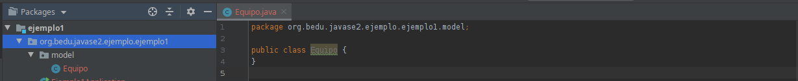
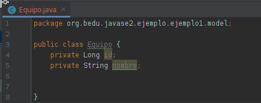
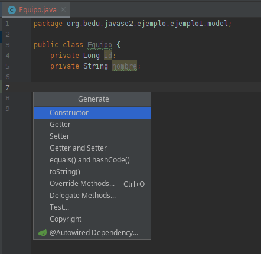
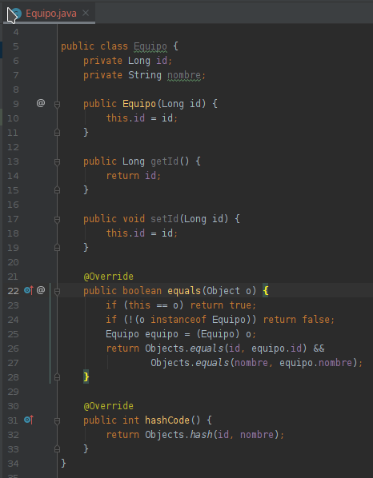
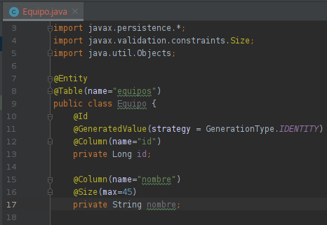
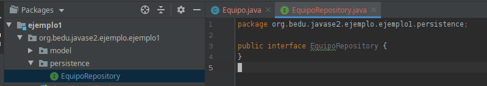
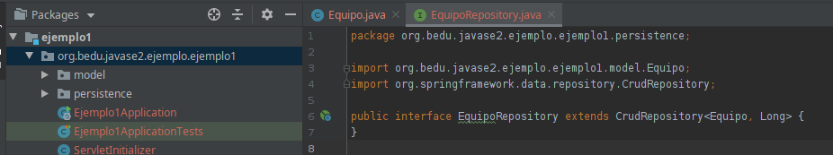

# Ejemplo 02

## Objetivo

- Crear una entidad usando el framework JPA junto con Spring Data para escribir y obtener información de una base de datos.

## Requisitos

- Apache Maven 3.8.4 o superior
- Manejador de base de datos, de preferencia MySQL o MariaDB
- JDK (o OpenJDK)

## Desarrollo
 
En esta ocasión crearás una entidad sencilla y su repositorio con ayuda de Spring Data.

Una entidad (_@Entity_) debe ser un **POJO** (Plain Old Java Object) con las siguietnes características:

1. Todos los accesores (**getters**).

2. Mutadores (setters) para los atributos no finales.

3. Debe [sobrecargar los métodos hashCode e equals de manera consistente](https://www.mkyong.com/java/java-how-to-overrides-equals-and-hashcode/).

Para crear el repositorio, basta con crear una **interface** que extienda **CrudRepository**.

<br/>

## Procedimiento

- ### Entidad
   1. Crea el paquete **org.bedu.javase2.ejemplo.ejemplo1.model** y en él crea la clase **Equipo**:

      

   2. Si analizas la descripción de la tabla equipos en la base de datos, tiene sólo un **id** (INT) y un **nombre** (varchar(45)), así que agregamos los valores correspondientes a la clase. (Nota que el **id**, aunque es entero en la base de datos, lo declaramos como **Long** en la entidad. Esto es por el tamaño (en bytes) que usa la base de datos para representar un entero).

      


   3. También es necesario agregar el código descrito al inicio del ejercicio. Este tipo de código es tan común que todos los IDEs tienen una opción para generarlo de forma automática, generalmente en el menú contextual.

      
      
      

   4. Ahora debemos anotar nuestra clase para que pueda ser mapeada a la base de datos.

      

      ```java
      package org.bedu.javase2.ejemplo.ejemplo1.model;

      import javax.persistence.*;
      import javax.validation.constraints.Size;
      import java.util.Objects;

      @Entity
      @Table(name="equipos")
      public class Equipo {
         @Id
         @GeneratedValue(strategy = GenerationType.IDENTITY)
         @Column(name="id")
         private Long id;

         @Column(name="nombre")
         @Size(max=45)
         private String nombre;

         public Equipo() {
         }

         public Long getId() {
            return id;
         }

         public void setId(Long id) {
            this.id = id;
         }

         public String getNombre() {
            return nombre;
         }

         public void setNombre(String nombre) {
            this.nombre = nombre;
         }

         @Override
         public boolean equals(Object o) {
            if (this == o) return true;
            if (!(o instanceof Equipo)) return false;
            Equipo equipo = (Equipo) o;
            return Objects.equals(id, equipo.id) &&
                     Objects.equals(nombre, equipo.nombre);
         }

         @Override
         public int hashCode() {
            return Objects.hash(id, nombre);
         }
      }
      ```

- ### Repositorio

   1. Crea el paquete **org.bedu.javase2.ejemplo.ejemplo1.persistence** y en él crea la interface **EquipoRepository**

      

   2. Indica que está extendiendo la interface **CrudRepository** y define la entidad que manejará como **Equipo** y su llave primaria como **Long**.

      

      ```java
      package org.bedu.javase2.ejemplo.ejemplo1.repository;

      import org.bedu.javase2.ejemplo.ejemplo1.model.Equipo;
      import org.springframework.data.repository.CrudRepository;

      public interface EquipoRepository extends CrudRepository<Equipo, Long> {
      }
      ```

- ### Verificación

   1. Inicia la aplicación con maven. Si todo sale bien no debería haber error alguno.

<br/>

¡Felicidades! Creaste tu primer entidad.

<br/>

[Siguiente ](../Reto-02/Readme.md)(Reto 2)