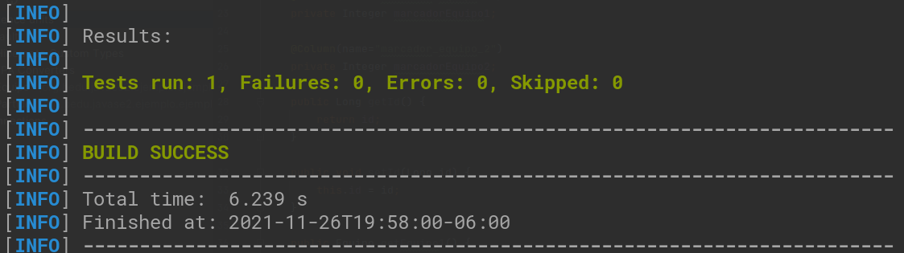
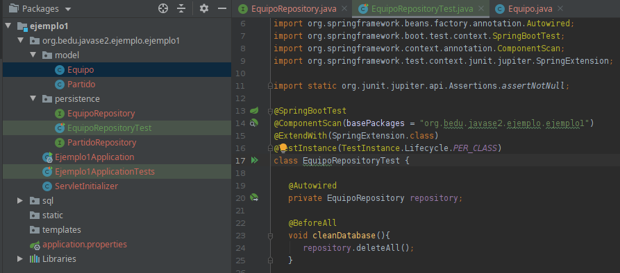
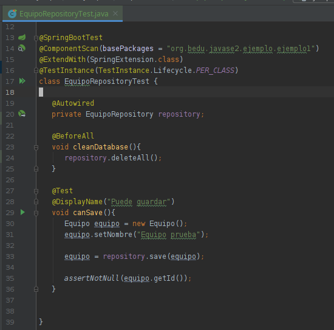
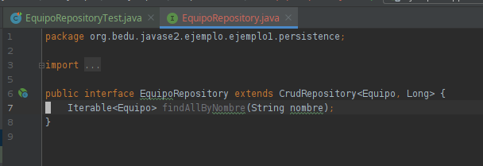
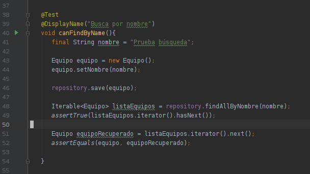
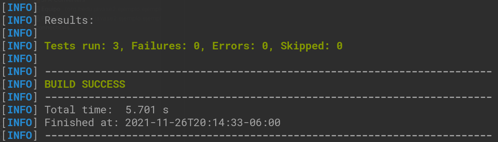
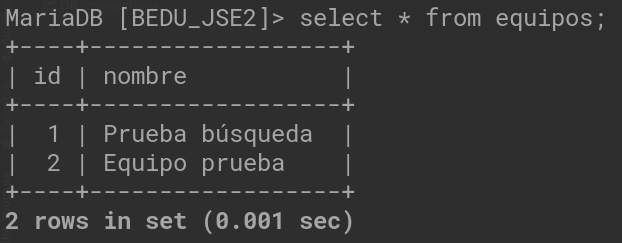

# Ejemplo 03

## Objetivo

- Hacer pruebas con JUnit para verificar el correcto funcionamiento de los repositorios.

## Requisitos

- Apache Maven 3.8.4 o superior
- JDK (o OpenJDK)

## Maven

En este ejercicio harás uso de pruebas de integración (Spring + JUnit) para verificar el funcionamiento del repositorio de
equipos.

**_Nota_**: Para ejecutar las pruebas con maven usa el comando

```bash
mvn test
```



## Desarrollo

1. Crea una clase de prueba para EquipoRepository con el contenido que se muestra en la figura.

   

2. Agrega una prueba donde crees un equipo y lo guardes como se muestra.

   

   Esta prueba verifica que el objeto, una vez guardado, tiene un Id asignado por la base de datos.

   ```java
   @SpringBootTest
   @ComponentScan(basePackages = "org.bedu.javase2.ejemplo.ejemplo1")
   @ExtendWith(SpringExtension.class)
   @TestInstance(TestInstance.Lifecycle.PER_CLASS)
   class EquipoRepositoryTest {

      @Autowired
      private EquipoRepository repository;

      @BeforeAll
      void cleanDatabase(){
         repository.deleteAll();
      }

      @Test
      @DisplayName("Puede guardar")
      void canSave(){
         Equipo equipo = new Equipo();
         equipo.setNombre("Equipo prueba");

         equipo = repository.save(equipo);
## Desarrollo
   

   ```java
   Iterable<Equipo> findAllByNombre(String nombre);
   ```

4. Agrega una nueva prueba para verificar el comportamiento.

   

   ```java
   @Test
   @DisplayName("Busca por nombre")
   void canFindByName(){
      final String nombre = "Prueba búsqueda";

      Equipo equipo = new Equipo();
      equipo.setNombre(nombre);

      repository.save(equipo);

      Iterable<Equipo> listaEquipos = repository.findAllByNombre(nombre);
      assertTrue(listaEquipos.iterator().hasNext());

      Equipo equipoRecuperado = listaEquipos.iterator().next();
      assertEquals(equipo, equipoRecuperado);
   ```

5. Ejecuta de nuevo el comando **mvn test**, comprueba que los test se ejecutan correctamente.

   

6. Consulta los registros de la tabla **equipos**, comenta los resultados.

   

<br/>

¡Felicidades! Creaste tu primer set de pruebas.

<br/>

[Siguiente ](../Reto-03/Readme.md)(Reto 3)