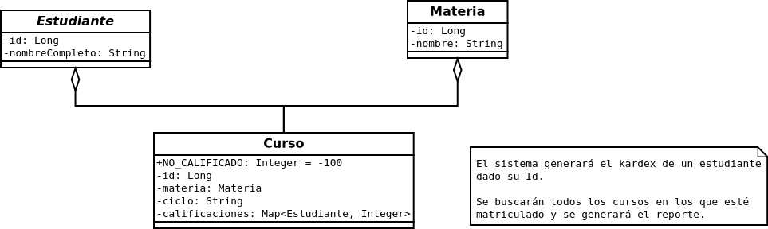
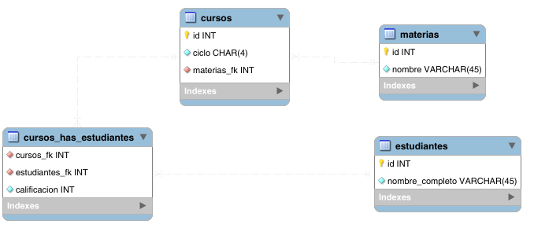

# Postwork 01: Gestión de bases de datos

## 🎩 Objetivo

- Practicar las consultas CRUD sobre la base de datos.
- Crear las entidades y repositorios que usaremos para nuestro proyecto personal.

## 🎯 Requisitos

- MySQL instalado y configurado
- Apache Maven 3.8.4 o superior
- JDK (o OpenJDK)

## 🚀 Desarrollo

A continuación deberás definir el proyecto, con el que trabajarás el resto de tus postwork, además servirá como proyecto personal.

Sigue estas instrucciones:

1. Clona el proyecto de la carpeta [base](./base).

2. A partir de los siguientes diagramas crea las entidades, los cuales serán utilizados como modelos.

    

    

    a. Curso
    
    b. Estudiante
    
    c. Materia

3. Ahora genera los repositorios.

    a. CursoRepository
    
    b. EstudianteRepository

    c. MateriaRepository

4. Ahora genera los siguientes casos de prueba:

    - Crear y almacenar (Por lo menos uno de cada uno):
        
        - Estudiante
    
        - Materia
    
        - Curso
        
    - Una vez creado el curso, agregar la calificación del estudiante.

5. Ya para terminar te recomendamos buscar información sobre las siguientes anotaciones 

    - @ElementCollection
    
    - @CollectionTable
    
    - @MapKeyJoinColumn.

 
 

## ✅ Checklist 

Asegúrate que tu postwork contenga todo lo siguiente, ya que esto se evaluará al término del módulo.

- [ ] El usuario puede ejecutar el proyecto base.

- [ ] El proyecto contiene los tres modelos (Curso, Estudiante y Materia).

- [ ] El proyecto contiene los tres repositorios (CursoRepository, EstudianteRepository y MateriaRepository)

- [ ] Las pruebas crean y almacenan, estudiante, materia y curso.

- [ ] Las pruebas asignan la calificación de algún estudiante en un curso.

 
 

[Regresar ](../Readme.md)(Sesión 01)

[Siguiente ](../../Sesion-02/Readme.md)(Sesión 02)
