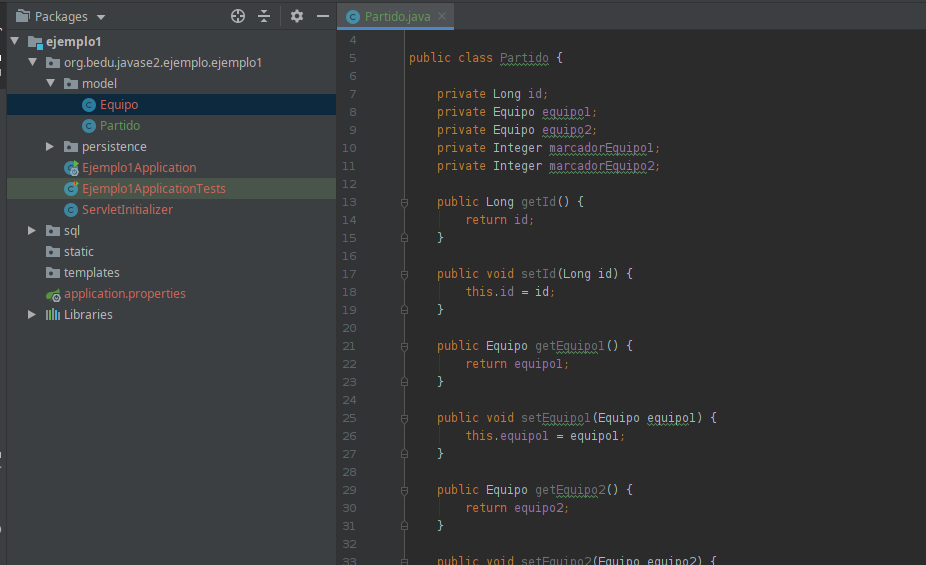
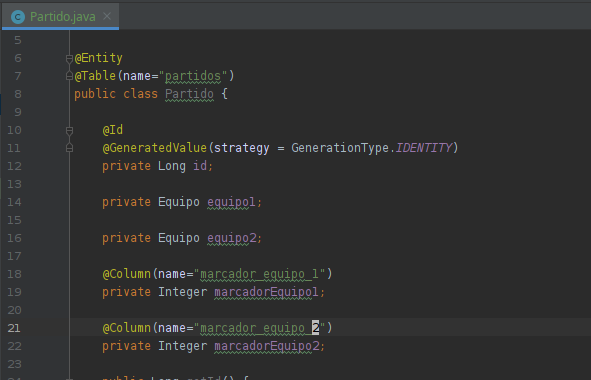
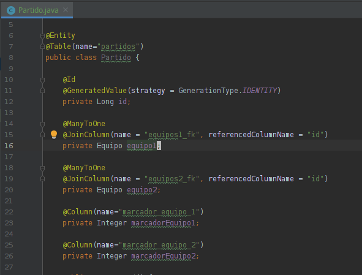
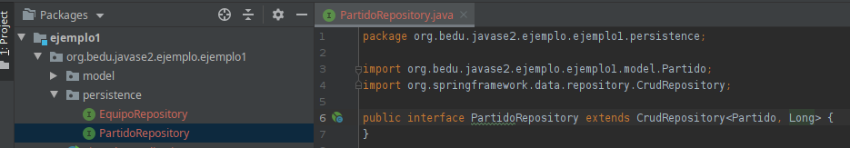

# Reto 02

## Objetivo

 - Crear una entidad que represente la información de la tabla **partido**.
 - Crear un *repositorio* que permita trabajar con la entidad **Partido**.

## Requisitos

- MySQL (o MariaDB)
- IntelliJ IDEA Community Edition
- Apache Maven 3.8.4 o superior
- JDK (o OpenJDK)
- Proyecto con modelo y repositorio (Proyecto del ejemplo 02)

## Desarrollo

En el Ejemplo 02 creaste tu primera entidad y repositorio. En ese ejercicio la clase era sencilla (no tiene agregación de ninguna otra). 

Para este reto deberás crear la entidad y repositorio de un partido.

Deberás hacer uso de las anotaciones **@ManyToOne** y **@JoinColumn**.

<br/>

<details>
  <summary>Solución</summary>

 1. Crea la clase **Partido** en el paquete **model** y agrega los atributos y código generado igual que en el Ejemplo 02.
         
    
  
 2. Agrega las anotaciones básicas para los atributos sencillos y para la clase.
 
    
      
 3. Agrega la anotacion **@ManyToOne** y **@JoinColumn** como se muestra en la imagen:
 
    
      
 4. Agrega el repositorio igual que en el Ejemplo 2:
	
    

    ```java
    package org.bedu.javase2.ejemplo.ejemplo1.model;

    import javax.persistence.*;
    import java.util.Objects;

    @Entity
    @Table(name="partidos")
    public class Partido {

        @Id
        @GeneratedValue(strategy = GenerationType.IDENTITY)
        private Long id;

        @ManyToOne
        @JoinColumn(name = "equipos1_fk", referencedColumnName = "id")
        private Equipo equipo1;

        @ManyToOne
        @JoinColumn(name = "equipos2_fk", referencedColumnName = "id")
        private Equipo equipo2;

        @Column(name="marcador_equipo_1")
        private Integer marcadorEquipo1;

        @Column(name="marcador_equipo_2")
        private Integer marcadorEquipo2;

        public Long getId() {
            return id;
        }

        public void setId(Long id) {
            this.id = id;
        }

        public Equipo getEquipo1() {
            return equipo1;
        }

        public void setEquipo1(Equipo equipo1) {
            this.equipo1 = equipo1;
        }

        public Equipo getEquipo2() {
            return equipo2;
        }

        public void setEquipo2(Equipo equipo2) {
            this.equipo2 = equipo2;
        }

        public Integer getMarcadorEquipo1() {
            return marcadorEquipo1;
        }

        public void setMarcadorEquipo1(Integer marcadorEquipo1) {
            this.marcadorEquipo1 = marcadorEquipo1;
        }

        public Integer getMarcadorEquipo2() {
            return marcadorEquipo2;
        }

        public void setMarcadorEquipo2(Integer marcadorEquipo2) {
            this.marcadorEquipo2 = marcadorEquipo2;
        }

        @Override
        public boolean equals(Object o) {
            if (this == o) return true;
            if (!(o instanceof Partido)) return false;
            Partido partido = (Partido) o;
            return id.equals(partido.id) &&
                    equipo1.equals(partido.equipo1) &&
                    equipo2.equals(partido.equipo2) &&
                    marcadorEquipo1.equals(partido.marcadorEquipo1) &&
                    marcadorEquipo2.equals(partido.marcadorEquipo2);
        }

        @Override
        public int hashCode() {
            return Objects.hash(id, equipo1, equipo2, marcadorEquipo1, marcadorEquipo2);
        }
    }
    ```

    <p>
    Para validar que todo esté correcto, inicia la aplicación con maven.
    </p>

</details>

<br/>

[Siguiente ](../Ejemplo-03/Readme.md)(Ejemplo 3)