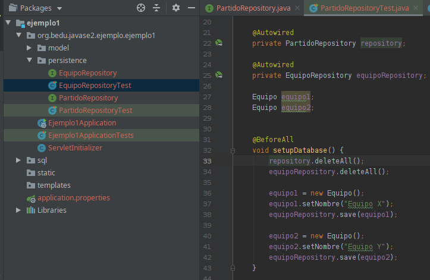
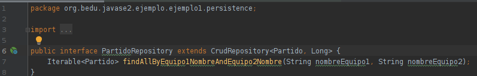
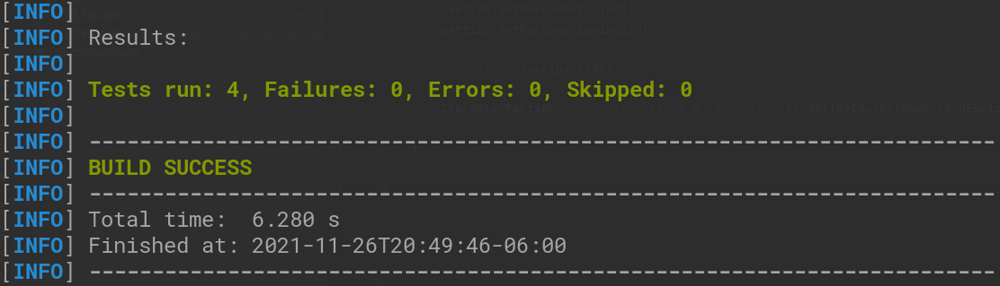
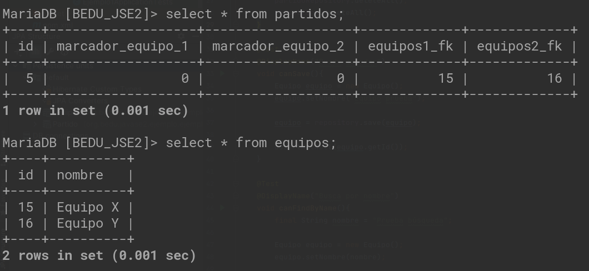

# Reto 03

## Objetivo

- Practicar las pruebas unitarias, para buscar un partido por su nombre en la tabla de Equipos.

## Requisitos

- Apache Maven 3.8.4 o superior
- JDK (o OpenJDK)
- Proyecto con pruebas unitarias (Proyecto del ejemplo 02)

## Desarrollo

- Crea el archivo de prueba tal como hiciste en el Ejemplo 3. En este caso tendrás que agregar ambos repositorios para poder hacer el setup completo.
- Deberás agregar el repositorio de partidos a la prueba de equipos, ya que no podemos garantizar el orden en que se ejecutan las pruebas y por las restricciones de llave foránea podríamos tener problemas al reiniciar la tabla. 
    
  - Este tipo de comportamiento de uso común es un excelente candidato para crear una clase de soporte.

<br/>

<details>
  <summary>Solución</summary>

  1.  Importa **PartidoRepository** en **EquipoRepositoryTest**

      ```java
      @Autowired
      private PartidoRepository partidoRepository;
      ```

  2. Limpia los datos del **partidoRepository** desde el método **cleanDatabase**.

      ```java
      partidoRepository.deleteAll();
      ```

  3. Crea el archivo **PartidoRepositoryTest**, importa los Equipos y ejecuta el setupDatabase.

      

      ```java
      @Autowired
      private PartidoRepository repository;

      @Autowired
      private EquipoRepository equipoRepository;

      Equipo equipo1;
      Equipo equipo2;

      @BeforeAll
      void setupDatabase() {
          repository.deleteAll();
          equipoRepository.deleteAll();

          equipo1 = new Equipo();
          equipo1.setNombre("Equipo X");
          equipoRepository.save(equipo1);

          equipo2 = new Equipo();
          equipo2.setNombre("Equipo Y");
          equipoRepository.save(equipo2);
      }
      ```

  4. Crea el QueryMethod:
 
      

  5. Agrega el método para busca por nombres, dentro de **PartidoRepositoryTest**.

      ```java
      @Test
      @DisplayName("Busca por nombres")
      void searchMatchByNames() {

          Partido partido = new Partido();
          partido.setEquipo1(equipo1);
          partido.setEquipo2(equipo2);
          partido.setMarcadorEquipo1(0);
          partido.setMarcadorEquipo2(0);

          repository.save(partido);

          Iterable<Partido> conjuntoPartidos = repository.findAllByEquipo1NombreAndEquipo2Nombre("Equipo X", "Equipo Y");

      }
      ```

  6. Ejecuta el comando **mvn test**, comprueba que los test se ejecutan correctamente.

      

  7. Consulta los registros de las tablas .

      

</details>


<br/>

[Siguiente ](../Postwork/Readme.md)(Postwork)