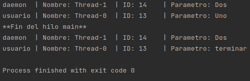

# Ejemplo 01: Creando un hilo

## Objetivo
- Comprender cómo se trabaja con hilos en Java mediante el uso de la clase Thread
- Crear un hilo de usuario
- Crear un hilo demonio

## Requisitos

- IntelliJ IDEA Community Edition
- JDK (o OpenJDK)

## Desarrollo

1. Creamos un nuevo proyecto de Java asegurándonos que usemos el JDK 11 o superior.

2. Agregamos la clase `MiHilo` que herede de la clase `Thread`.

    ```java
    public class MiHilo extends Thread {

    }
    ```

3. Dentro de la clase `MiHilo`, agregamos una propiedad llamada **parametro** de tipo `String` que será la que definirá cuándo termina nuestro hilo. Con su respectivo constructor.

    ```java
    String parametro;

    public MiHilo(String parametro){
        this.parametro = parametro;
    }
    ```

4. Hacemos Override del método `run` definido en `Thread` y agregaremos el siguiente código:

    ```java
    @Override
    public void run(){
        while(!"terminar".equals(parametro)){
            mostrarInformacion();
            pausarUnSegundo();
        }
        mostrarInformacion();
    }

    public void setParametro(String parametro){
        this.parametro = parametro;
    }
    ```

5. La implementación de los métodos `mostrarInformacion` y `pausarUnSegundo` será:
    
    ```java
    private void mostrarInformacion() {
        String tipoHilo = isDaemon() ? "daemon" : "usuario";
        System.out.println(tipoHilo + "\t| Nombre: " + getName() + "\t| ID: " + getId() + "\t| Parametro: " + parametro);
    }
    
    public static void pausarUnSegundo() {
        try {
            TimeUnit.SECONDS.sleep(1);
        } catch (InterruptedException e) {
            e.printStackTrace();
        }
    }
    ```

6. Por último, creamos 2 objetos `MiHilo` en el método **main** de nuestra aplicación, uno de ellos será un hilo de usuario y el segundo será un hilo demonio:

    ```java
    public static void main(String[] args) {
        MiHilo hilo1 = new MiHilo("Uno");
        hilo1.start();

        MiHilo hilo2 = new MiHilo("Dos");
        hilo2.setDaemon(true);
        hilo2.start();

        MiHilo.pausarUnSegundo();
        hilo1.setParametro("terminar"); // Demostrar qué pasa si no se pone esta línea
        System.out.println("**Fin del hilo main**");
    }
    ```

7. Por último ejecutamos el proyecto y observamos la salida, comprobando qué pasa con la información que imprime cada hilo.

    

<br/>

¡Felicidades! Completaste el primer ejemplo.

<br/>

[Siguiente ](../Reto-01/Readme.md)(Reto 1)