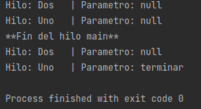

# Ejemplo 02: Implementando la interfaz Runnable

## Objetivo

- Familiarizarse con la interfaz Runnable, el único método que define y la forma en que se incorpora a un Thread para su ejecución

## Requisitos

- IntelliJ IDEA Community Edition
- JDK (o OpenJDK)

## Desarrollo

A continuación se muestra una tabla comparativa de **Thread** vs **Runnable**.

| Bases para la comparación | Hilo | Ejecutable |
| ------------- | ------------- |------------- |
|  |  |  |
| BASIC | Cada hilo crea un objeto único y se asocia con él. | Varios hilos comparten los mismos objetos. |
| Memoria | Como cada hilo crea un objeto único, se requiere más memoria. | Como varios subprocesos comparten el mismo objeto, se utiliza menos memoria. |
| Extensible | En Java, la herencia múltiple no está permitida, por lo tanto, después de que una clase extiende la clase Thread, no puede extender ninguna otra clase. | Si una clase define un subproceso que implementa la interfaz Runnable, tiene la posibilidad de extender una clase. |
| Utilizar | Un usuario debe extender la clase de subproceso solo si desea anular los otros métodos en la clase de subproceso. | Si solo desea especializar el método de ejecución, entonces implementar Runnable es una mejor opción. |
| Acoplamiento | La clase Thread extendida introduce un acoplamiento estrecho ya que la clase contiene el código de la clase Thread y también el trabajo asignado al hilo | La implementación de la interfaz Runnable introduce un acoplamiento suelto, ya que el código de Thread está separado del trabajo de Threads. |

<br/>

Una vez revisada la información previa, comenzamos con los pasos del ejemplo.

<br/>

1. Nos ubicamos en el proyecto del ejemplo 1.

2. Agregamos la clase `MiRunnable` que implementará la interfaz `Runnable`.

	```java
    public class MiRunnable implements Runnable {

    }
    ```

3. Dentro de la clase `MiRunnable`, Agregamos una propiedad llamada **parametro** de tipo `String` que será la que definirá cuándo termina nuestro hilo y también otra propiedad llamada **nombre** que nos permitirá distinguir entre nuestros hilos, debido a que no existe algún método para saber el id de nuestro hilo o si es un demonio.

	```java
    private String parametro, nombre;
	```

4. Agregamos el constructor que reciba nombre, además el set de parametro.

	```java
    public MiRunnable(String nombre) {
        this.nombre = nombre;
    }

	public void setParametro(String parametro) {
        this.parametro = parametro;
    }
	```

5. Hacemos Override del método `run` definido en `Runnable` y agregaremos el siguiente código:

	```java
	@Override
	public void run() {
		while(!"terminar".equals(parametro)){
			mostrarInformacion();
			pausarUnSegundo();
		}
		mostrarInformacion();
	}
	```

6. La implementación de los métodos `mostrarInformacion` y `pausarUnSegundo` será:

	```java
	public static void pausarUnSegundo() {
		try {
			TimeUnit.SECONDS.sleep(1);
		} catch (InterruptedException e) {
			e.printStackTrace();
		}
	}

	private void mostrarInformacion() {
		System.out.println("Hilo: " + nombre + "\t| Parametro: " + parametro);
	}
	```

7. Por último, creamos 2 objetos `MiRunnable` en el método **main** de nuestra aplicación, uno de ellos será un hilo de usuario y el segundo será un hilo demonio:

	```java
	public static void main(String[] args) {
		MiRunnable runnable1 = new MiRunnable("Uno");
        MiRunnable runnable2 = new MiRunnable("Dos");

        Thread t1 = new Thread(runnable1);
        t1.start();

        Thread t2 = new Thread(runnable2);
        t2.setDaemon(true);
        t2.start();

        MiRunnable.pausarUnSegundo();
        runnable1.setParametro("terminar");
        System.out.println("**Fin del hilo main**");
	}
	```

8. Ejecutamos el proyecto y observamos la salida, comprobando qué pasa con la información que imprime cada hilo.

    


<br/>
<br/>

[Siguiente ](../Reto-02/Readme.md)(Reto 2)