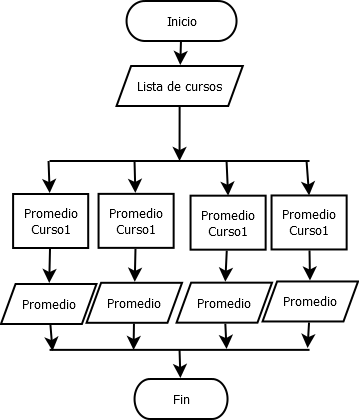

# Postwork Sesión 02: Cálculo de promedios mediante hilos 

## 🎩 Objetivo 

- Practicar el uso de hilos con Java.
- Calcular promedios a través de múltiples hilos en tu proyecto personal.

## 🎯 Requisitos 

- MySQL instalado y configurado
- Apache Maven 3.8.4 o superior
- JDK (o OpenJDK)

## 🚀 Desarrollo

Completa las siguientes instrucciones para completar tu segundo postwork:

1. Utiliza el proyecto del postwork 1.

2. Crea un nuevo package con el nombre de multithreading 

3. Crea la clase CalculadorPromedioCurso que implemente un Runnable, su constructor deberá obtener el curso, con las calificaciones a promediar; Además el run deberá calcular el promedio y mostrar el resultado junto con el nombre del curso.

4. Genera la clase Postwork2  la cual deberá generar los cursos (Cuatro como mínimo) con calificaciones aleatorias para cada uno de sus estudiantes. Como muestra dejaremos 20 estudiantes por curso.

5. Una vez generada la información deberás ejecutar el Runnable con un ExecutorService. Donde cada hilo deberá calcular cada curso.

 

A continuación te dejamos una imagen donde puede visualizar el flujo general que tomará la aplicación.

 
 

## ✅ Checklist 

Asegúrate que tu postwork contenga todo lo siguiente, ya que esto se evaluará al término del módulo.

- [ ] CalculadorPromedioCurso es un runnable y su constructor recibe un curso.

- [ ] CalculadorPromedioCurso calcula el promedio de las calificaciones e imprime el resultado.

- [ ] Postwork2 genera por lo menos 4 cursos con 20 estudiantes con calificaciones aleatorias.

- [ ] Los cursos son promediados con hilos independientes con ExecutorService.

 
 

[Regresar ](../Readme.md)(Sesión 02)

[Siguiente ](../../Sesion-03/Readme.md)(Sesión 03)