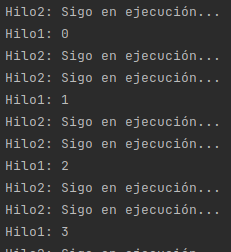

# Reto 01: Creando un hilo

## Objetivo
- Emplear la clase Thread de Java para la creación de una aplicación simple que realice tareas en diferentes hilos.

## Requisitos
- IntelliJ IDEA Community Edition
- JDK (o OpenJDK)

## Desarrollo
Deberás desarrollar una pequeña aplicación que mediante 2 hilos (uno de usuario y uno daemon) realice un par de tareas:

- En el hilo de usuario deberás imprimir los números del 1 al 10 cada segundo.
- En el hilo daemon solo deberás imprimir cada medio segundo la frase "Sigo en ejecución".

Recuerda que debes instanciar e iniciar los objetos necesarios para cada hilo desde el método main de tu aplicación y la lógica principal de cada hilo está ubicada en el método run de tu clase hilo.

<br/>

<details>
	<summary>Solución</summary>
	
 1. Para resolver este reto tendrás que crear dos clases diferentes que hereden de Thread, dentro de la primera en el método run solo deberás incluir un for del 1 al 10 inclusivo en el que esté la instrucción System.out.println y un sleep por 1 segundo.

    ```java
    public class Hilo1 extends Thread {
		@Override
		public void run() {
			for (int i = 0; i <= 10; i++) {
				System.out.println("Hilo1: " + i);
				try {
					TimeUnit.SECONDS.sleep(1);
				} catch (InterruptedException e) {
					e.printStackTrace();
				}
			}
		}
	}
    ```

 2. En la segunda clase, tendrás que agregar la instrucción System.out.println con el mensaje "Sigo en ejecución" y un sleep por 500 milisegundos dentro de un ciclo infinito.

	```java
	public class Hilo2 extends Thread {
		@Override
		public void run() {
			while(true){
				System.out.println("Hilo2: Sigo en ejecución...");
				try {
					TimeUnit.MILLISECONDS.sleep(500);
				} catch (InterruptedException e) {
					e.printStackTrace();
				}
			}
		}
	}
	```

 3. En el método main deberás crear una instancia de cada clase sin olvidar establecer el atributo daemon como true para la segunda.

	```java
	Hilo1 h1 = new Hilo1();
	Hilo2 h2 = new Hilo2();
	h2.setDaemon(true);

	h1.start();
	h2.start();
	```
	
 4. Por último, no olvides iniciar cada uno de los hilos y ejecutar la aplicación para verificar los resultados.

    

</details>


<br/>
<br/>

[Siguiente ](../Ejemplo-02/Readme.md)(Ejemplo 2)