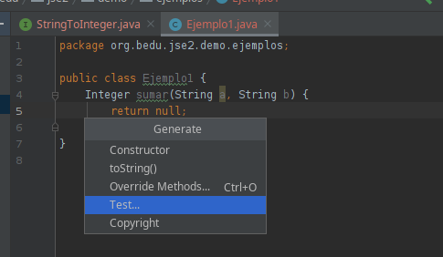

# Ejemplo 01: Definiendo una interfaz funcional

## Objetivo
 - Conocer los elementos básicos de las interfaces funcionales en Java
 - Crear tu primera inerface funcional

## Requisitos

- Apache Maven 3.8.4 o superior
- JDK (o OpenJDK)

## Maven

Para ejecutar las pruebas de maven usa:
```bash
mvn test
```

## Procedimiento

- Definiendo la interfaz

    1. Descarga el código del módulo [Código](codigo)

    2. En el paquete `org.bedu.jse2.demo.ejemplos` crea la interfaz `StringToInteger`

    3. Anota la interfaz con ***@FunctionalInterface***

    4. Define el método abstracto

        ```java
        Integer convertir(String str);
        ```


- Clase contenedora

    1. Crea la clase Ejemplo1 en el paquete `org.bedu.jse2.demo.ejemplos`.

    2. Agrega el siguiente bloque de código: 

        ```java
        Integer sumar(String a, String b){
            return null;
        }
        ```

- Prueba unitaria

    1. Crea una prueba para la clase Ejemplo1

        

    2. Agrega el siguiente código:

        ```java
        @Test
        @DisplayName("Suma dos strings convertidos a enteros")
        void addsUpTwoIntegers(){
            String a = "4";
            String b = "8";
            Integer expected = 12;

            Ejemplo1 ejemplo1 = new Ejemplo1();

            assertEquals(expected, ejemplo1.sumar(a,b));
        }
        ```

        Si ejecutas la prueba en este momento obtendrás un error ya que estamos regresando `null`.


- Implementando la interfaz (clase anónima)

    1. Reemplaza el código de la clase de la siguiente manera:

        ```java
        public class Ejemplo1 {

        private final StringToInteger parser = new StringToInteger() {
            @Override
            public Integer convertir(String str) {
                return Integer.parseInt(str);
            }
        };

            Integer sumar(String a, String b) {

                return parser.convertir(a) + parser.convertir(b);
            }
        }
        ```

    2. Vuelve a ejecutar la prueba

        En este primer ejemplo estamos usando un método tradicional implementando una clase anónima.


- Implementando la interfaz (lambda)

    1. Reemplaza el código de la clase de la siguiente manera

        ```java
        public class Ejemplo1 {

        private final StringToInteger parser = s -> Integer.parseInt(s);

            Integer sumar(String a, String b) {

                return parser.convertir(a) + parser.convertir(b);
            }
        }
        ```

    2. Vuelve a ejecutar la prueba

        Esta vez hemos usado una lambda para proveer la implementación de la interfaz. El código es mucho más legible

- Implementando la interfaz (referencia a método)

    1. Reemplaza el código de la clase de la siguiente manera

        ```java
        public class Ejemplo1 {

        private final StringToInteger parser =  Integer::parseInt;

            Integer sumar(String a, String b) {

                return parser.convertir(a) + parser.convertir(b);
            }
        }
        ```

    2. Vuelve a ejecutar la prueba

        Finalmente, cuando una lambda simplemente pasa su argumento a un método, podemos reemplazarla por una referencia directa a ese método, como hicimos en este caso con `Integer::parseInt`.


<br/>

¡Felicidades! Completaste el primer ejemplo.

<br/>

[Siguiente ](../Reto-01/Readme.md)(Reto 1)