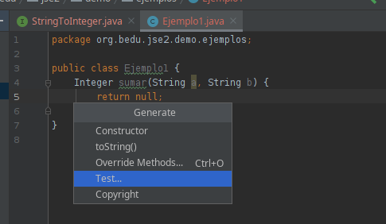

# Ejemplo 03: Streams

## Objetivo

- Hacer uso de streams para manipular valores de entrada de un conjunto.
- Dado un conjunto de números, podamos aplicar un filtro y obtener la suma.

## Requisitos

- Apache Maven 3.8.4 o superior
- JDK (o OpenJDK)

## Maven

Para ejecutar las pruebas de maven usa:

```bash
mvn test
```

## Desarrollo

- Clase contenedora

  1. Crea la clase **Ejemplo3** en el paquete **org.bedu.jse2.demo.ejemplos**

  2. Agrega el siguiente bloque de código:

      ```java
      Integer manipular(Iterable<Integer> conjunto, IntUnaryOperator transformacion){
        return null;
      }
      ```

- Prueba unitaria

  1. Crea una prueba para la clase **Ejemplo3**.
    
      
    
  2. Agrega el siguiente código:

      ```java
      import static org.assertj.core.api.Assertions.assertThat;

      class Ejemplo3Test {

        @Test
        @DisplayName("Manipula y suma")
        void transformsAndAdsUp(){
            Ejemplo3 ejemplo3 = new Ejemplo3();

            List<Integer> conjunto = Arrays.asList(1,4,-6,7,3,5,-1);

            Integer expected = -27;

            Assertions.assertThat(ejemplo3.manipular(conjunto, i -> i < 0 ? i:-i)).isEqualTo(expected);

        }
      }
      ```

  3. Si ejecutas la prueba en este momento fallará ya que estamos regresando `null`.

      ¿Qué es lo que hace la función que se está pasando a la prueba?


- Implementando la funcionalidad 

  1. Reemplaza el código de la clase **Ejemplo3** de la siguiente manera:
  
      ```java
      Integer manipular(List<Integer> conjunto, IntUnaryOperator transformacion){
            return conjunto.stream().mapToInt(s -> s).map(transformacion).sum();
        }
      ```

  2. Vuelve a ejecutar la prueba

      `Stream` tiene una subclase especializada llamada `IntStream`, la cual implementa algunos métodos específicos como **sum** (que usamos como operación terminal). 

      Para convertir nuestro **Stream** en **IntStream** usamos la operación **mapToInt**.

      Puedes ver que, gracias a Stream hemos logrado la funcionalidad en una sola línea de código.


<br/>
<br/>

[Siguiente ](../Reto-03/Readme.md)(Reto 03)