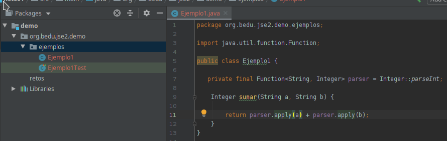

# Reto 01

## Objetivo

- Usar las interfaces propias de Java para poder realizar la conversión de un objeto de tipo **String** a un objeto de tipo **Integer**.

## Requisitos

- Apache Maven 3.8.4 o superior
- JDK (o OpenJDK)

## Maven

Para ejecutar las pruebas de maven usa:
```bash
mvn test
```

## Desarrollo

En el Ejemplo 1 creamos nuestra propia interfaz para convertir un `String` en un entero. 

Para completar este reto reemplaza la interfaz propia por una de las genéricas que proporciona Java.

<br/>

<details>
  <summary>Solución</summary>

 1. Elimina la interfaz **StringToInteger**

 2. Abre la clase **Ejemplo1**
      
 3. Reemplaza el uso de **StringToInteger** por **Function<String, Integer>** y el método **convertir** por **apply** (el método de la interfaz *Function*).
 
    

 4. Vuelve a ejecutar la prueba.

<p>
Java provee de un amplio conjunto de interfaces funcionales de uso general lo que nos permite no tener que definir las propias constantemente.
</p>

<p>
Es recomendable familiarizarse con este catálogo para poder usarlo cuando sea necesario.
</p>

</details>


<br/>
<br/>

[Siguiente ](../Ejemplo-02/Readme.md)(Ejemplo 02)