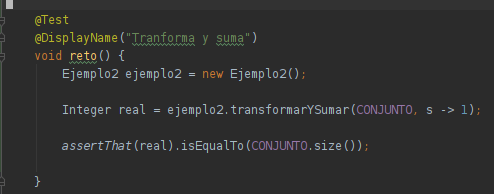
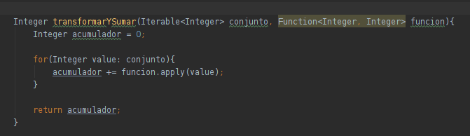
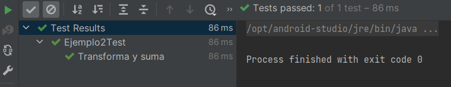

# Reto 02

## Objetivo

- Realizar una High Order Function para recibir un conjunto de enteros y realizar la suma de todos ellos.

## Requisitos

- Apache Maven 3.8.4 o superior
- JDK (o OpenJDK)

## Maven

Para ejecutar las pruebas de maven usa:
```bash
mvn test
```

## Desarrollo

En el Ejemplo 2 creamos un método capaz de recibir un objeto Iterable de enteros y una función que los transforma. 

1. Para completar este reto deberás implementar el siguiente método, la cual debe transformar el número recibido para posteriormente sumarlo.

    ```java
    Integer transformarYSumar(Iterable<Integer> conjunto, Function<Integer, Integer> funcion);
    ```

    Dentro de la clase ejemplo 2.

2. Una vez agregado el método, ejecuta la prueba desde la clase **Ejemplo2Test**


<br/>

<details>
  <summary>Solución</summary>

 1. Agrega un caso de prueba con el valor esperado:
 
    ```java
    @Test
    @DisplayName("Transforma y suma")
    void reto(){
        Ejemplo2 ejemplo2 = new Ejemplo2();

        Integer real = ejemplo2.transformarYSumar(CONJUNTO, s -> 1);

        assertThat(real).isEqualTo(CONJUNTO.size());
    }
    ```

    

 2. Abre la clase Ejemplo2 y agrega el siguiente código:

    ```java
    Integer transformarYSumar(Iterable<Integer> conjunto, Function<Integer, Integer> funcion){
        Integer acumulador = 0;

        for(Integer value: conjunto){
            acumulador += funcion.apply(value);
        }

        return acumulador;
    }
    ```
 
      
      
 3. Vuelve a ejecutar la prueba.

    <p>
    Los dos métodos que implementamos son semejantes a los operadores `map` y reduce de `Streams`. La diferencia es que aquellos no reciben un iterable, sino que Stream itera la función internamente.
    </p>


      

</details>


<br/>
<br/>

[Siguiente ](../Ejemplo-03/Readme.md)(Ejemplo 03)