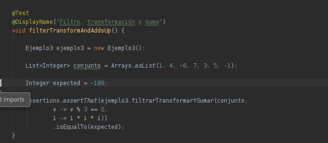
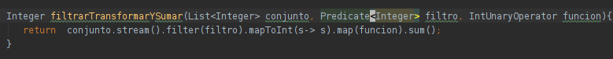

# Reto 3

## Objetivo

- Realizar una High Order Function para transformar valores.

## Requisitos

- Apache Maven 3.8.4 o superior
- JDK (o OpenJDK)

## Maven

Para ejecutar las pruebas de maven usa:

```bash
mvn test
```

## Desarrollo

En el Ejemplo 3 creamos un método capaz de recibir un una lista de enteros y una función que los transforma, sumando los valores. 

1. Para este reto deberás implementar el siguiente método que aplicará un filtro para aplicar la transformación sólo a los valores deseados.

      Agrega el método dentro de una nueva clase llamada Ejemplo3.

      ```java
      Integer filtrarTransformarYSumar(List<Integer> conjunto, Predicate<Integer> filtro, IntUnaryOperator funcion);
      ```

2. Una vez agregado el método, ejecuta la prueba desde la clase **Ejemplo3Test**

<br/>

<details>
  <summary>Solución</summary>

 1. Agrega un caso de prueba con el valor esperado:

    ```java
    @Test
    @DisplayName("Filtro, transformación y suma")
    void filterTransformAndAddsUp() {

        Ejemplo3 ejemplo3 = new Ejemplo3();

        List<Integer> conjunto = Arrays.asList(1, 4, -6, 7, 3, 5, -1);

        Integer expected = -189;

        Assertions.assertThat(ejemplo3.filtrarTransformarYSumar(conjunto,
                        v -> v % 3 == 0,
                        i -> i * i * i))
                .isEqualTo(expected);
    }
    ```
 
    
	 
 2. Abre la clase Ejemplo2 y agrega el siguiente código:

    ```java
    Integer filtrarTransformarYSumar(List<Integer> conjunto, Predicate<Integer> filtro, IntUnaryOperator funcion) {
        return conjunto.stream().filter(filtro).mapToInt(s -> s).map(funcion).sum();
    }
    ```
 
    
	 
 3. Vuelve a ejecutar la prueba

</details>


<br/>
<br/>

[Siguiente ](../Postwork/Readme.md)(Postwork)