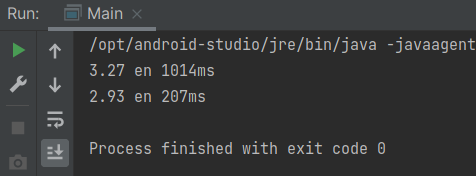

# Ejemplo 01: Recolectando información de sensores

## Objetivo
- Aplicar una simulación de una aplicación en el mundo real del procesamiento asíncrono

## Requisitos
- IntelliJ IDEA Community Edition
- JDK (o OpenJDK)

## Desarrollo

Imaginemos que tenemos un sistema que recolecta la información de 10 sensores distintos cada cierto tiempo y calcula el promedio de los valores obtenidos. 
Implementaremos la lectura y el cálculo de dicha información de manera secuencial y de manera paralela y compararemos el tiempo que le toma a cada una de las formas el realizar el cálculo.

1. Agregaremos una nueva clase llamada **SistemaMedicion**, que tendrá un método **leer** que recibirá el id del sensor para el que se leerá el valor y retornará un valor double, cuya implementación será la siguiente:

	```java
	double leer(int id){
		try{
			TimeUnit.MILLISECONDS.sleep(100);
		} catch (InterruptedException e) {
			e.printStackTrace();
		}
		return id * Math.random();
	}
	```

2. A nuestra clase **Main** agregaremos un método estático llamado **obtenerPromedio**. Dentro de este método tomaremos el tiempo que le lleva a cada implementación realizar el cálculo. Su implementación es:

	```java
	static void obtenerPromedio(Stream <Integer> ids){
		LocalTime inicio = LocalTime.now(); //registramos el tiempo de inicio
		double promedio = ids.mapToDouble(id -> new SistemaMedicion().leer(id)) //pasamos el stream de números a nuestro sensor
				.average()      //calcula el promedio de los valores
				.orElse(0); // retorna 0 si no pudo obtener los valores
		Duration tiempo = Duration.between(inicio, LocalTime.now());    //registramos el tiempo de fin
		System.out.println((Math.round(promedio * 100.) / 100.) + " en " + tiempo.toMillis() + "ms"); //imprimimos el resultado
	}
	```

3. Por último, dentro de nuestro main crearemos una lista del 1 al 10 y la pasaremos a nuestro método obtenerPromedio, una vez de forma secuencial y la otra de forma paralela:

	```java
    List<Integer> ids = IntStream.range(1, 11)
                .boxed()
                .collect(Collectors.toList()); //creamos una lista del 1 al 10
        obtenerPromedio(ids.stream());          //procesamiento concurrente
        obtenerPromedio(ids.parallelStream());  //procesamiento parallel
	```

4. Ejecutaremos nuestro código y compararemos el tiempo que le toma a cada implementación realizar el cálculo, sin preocuparnos porque los valores obtenidos de promedio serán distintos debido a que se obtienen números aleatorios en cada medición.

	

	¡Comenta los resultados!

<br/>

¡Felicidades! Completaste el primer ejemplo.

<br/>

[Siguiente ](../Reto-01/Readme.md)(Reto 1)