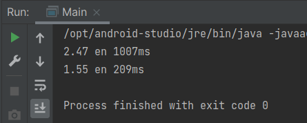

# Ejemplo 02: Recolectando información de sensores con un CompletableFuture

## Objetivo
- Emplear la clase CompletableFuture para el procesamiento asíncrono de información.

## Requisitos
- IntelliJ IDEA Community Edition
- JDK (o OpenJDK)

## Desarrollo
Basándonos en el sistema de medición del ejemplo 1, haremos los cambios necesarios para que emplee la API Future de Java. Para ello: 

1. Crearemos un nuevo método llamado **ejemploCompletableFuture**, en el que volveremos a generar la lista de valores enteros llamada id.

	```java
	List<Integer> ids = IntStream.range(1, 11)
		.boxed()
		.collect(Collectors.toList()); //creamos una lista del 1 al 10

	obtenerPromedio(ids.stream());          //procesamiento concurrente
	```

2. Llamaremos también al método **obtenerPromedio** que realiza el cálculo de manera secuencial, para tener un punto de comparación entre nuestros resultados.

	```java
    static void obtenerPromedio(Stream<Integer> ids){
        LocalTime inicio = LocalTime.now(); //registramos el tiempo de inicio
        double promedio = ids.mapToDouble(id -> new SistemaMedicion().leer(id)) //pasamos el stream de números a nuestro sensor
                .average()      //calcula el promedio de los valores
                .orElse(0); // retorna 0 si no pudo obtener los valores
        Duration tiempo = Duration.between(inicio, LocalTime.now());    //registramos el tiempo de fin
        System.out.println((Math.round(promedio * 100.) / 100.) + " en " + tiempo.toMillis() + "ms"); //imprimimos el resultado
    }
	```

3. Crearemos una lista de **CompletableFuture** mediante un stream de nuestra lista de ids, llamándolos de manera asíncrona para no esperar a que cada uno termine su procesamiento. Esto se realizará de la siguiente manera:

	```java
	List<CompletableFuture<Double>> futuros = ids.stream()
			//llamamos a la ejecución de la lectura de los sensores de manera asíncrona
		.map(id -> CompletableFuture.supplyAsync(() -> new SistemaMedicion().leer(id)))
		.collect(Collectors.toList());
	```

4. Registraremos el tiempo de inicio y tiempo final, como en el caso del procesamiento secuencial. Además realizaremos las operaciones necesarias para extraer los valores de los CompletableFuture, y en base al stream obtenido calcularemos el promedio de dichos valores:

	```java
	LocalTime inicio = LocalTime.now(); //registramos el tiempo de inicio
        double promedio = futuros.stream()
                .mapToDouble(cf -> cf.join())//extraemos el valor del CompletableFuture
                .average()                  //calculamos promedio
                .orElse(0);
	Duration tiempo = Duration.between(inicio, LocalTime.now());    //registramos el tiempo de fin
	System.out.println((Math.round(promedio * 100.) / 100.) + " en " + tiempo.toMillis() + "ms"); //imprimimos el resultado
	```

5. Ejecutaremos nuestro código y comprobaremos el tiempo que toma a cada implementación terminar, comenta los resultados.

	


<br/>
<br/>

[Siguiente ](../Reto-02/Readme.md)(Reto 2)