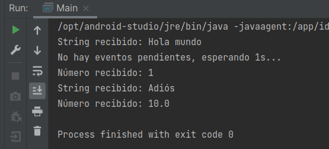

# Ejemplo 03: Event loop

## Objetivo
- Crear un event loop sencillo que permita manejar distintos tipos de eventos.

## Requisitos
- IntelliJ IDEA Community Edition
- JDK (o OpenJDK)

## Desarrollo
Como ya vimos, un **event loop** es un hilo que se ejecuta continuamente y recibe eventos que son pasados a métodos diferentes que son conocidos como event handlers o workers. 

En este caso crearemos un event loop simple que recibirá instancias de objetos y llamará a un event handler que reaccionará dependiendo del tipo de la instancia recibida.

1. Crea una interfaz llamada **EventHandler**, que será la interfaz que tendremos que implementar para definir nuestros worker para los eventos que reciba nuestro event loop. En esta interfaz definiremos un método llamado **procesarEvento** que recibirá un Object:

	```java
	public interface EventHandler {
		void procesarEvento(Object evento);
	}
	```

2. Ahora crea una clase llamada **EventLoopSimple**, misma que implementará la interfaz Runnable de Java. Nuestra clase tendrá una bandera que definirá si sigue en ejecución, una lista de tareas pendientes y un EventHandler que será el que ejecute las tareas pendientes:

	```java
	public class EventLoopSimple implements Runnable {

		private boolean enEjecucion = false;
		private Queue<Object> listaTareas = new LinkedList<>();
		private final EventHandler worker;
	}
	```

3. Agrega un constructor donde pasaremos el EventHandler que requiramos para nuestra implementación y definiremos el método **run** obligado por la interfaz Runnable.

	En este método tendremos un ciclo que se ejecutará mientras la variable **enEjecucion** lo diga o mientras tengamos tareas pendientes en nuestra lista. 
	
	Desde aquí llamaremos a nuestro **worker** pasándole los eventos que vamos recibiendo y esperaremos un tiempo entre cada vez que ejecutamos el ciclo. Si no tenemos tareas pendientes esperaremos 1 segundo a que se reciban más tareas:

	```java
	public EventLoopSimple(EventHandler worker) {
		this.worker = worker;
	}

	@Override
	public void run() {
		try{
			while(enEjecucion || !listaTareas.isEmpty()){
				Object evento = listaTareas.poll();

				if(evento == null){
					System.out.println("No hay eventos pendientes, esperando 1s...");
					TimeUnit.SECONDS.sleep(1);
				}
				worker.procesarEvento(evento);
				TimeUnit.MILLISECONDS.sleep(100);
			}
		} catch (InterruptedException e) {
			enEjecucion = false;
			e.printStackTrace();
		}

	}
	```

3. Definimos los métodos auxiliares para iniciar, detener, registrar eventos y consultar el estado de nuestro worker:

	```java
	public void iniciar(){
		this.enEjecucion = true;
		new Thread(this).start();
	}

	public void detener(){
		this.enEjecucion = false;
	}

	public void registrarEvento(Object evento){
		listaTareas.add(evento);
	}

	public boolean isEnEjecucion(){
		return enEjecucion;
	}
	```

4. Ahora, en nuestro método main creamos una instancia de **EventLoopSimple** y crearemos un EventHandler mediante una expresión lambda. En este handler manejaremos eventos de tipo String y de tipo Number, imprimiendo el valor recibido en consola:

	```java
	EventLoopSimple eventLoop = new EventLoopSimple(evento -> {
		if (evento instanceof String) {
			System.out.println("String recibido: " + evento);
		} else if (evento instanceof Number) {
			System.out.println("Número recibido: " + evento);
		}
	});
	```

5. Iniciamos nuestro Event Loop, registramos nuestro primer evento y esperaremos **500ms** para que se ejecute. Después registramos otros 3 eventos y finalizaremos nuestro programa.

	```java
	eventLoop.iniciar();
	eventLoop.registrarEvento("Hola mundo");

	try {
		TimeUnit.MILLISECONDS.sleep(500); //simulando acciones diferentes con un sleep
	} catch (InterruptedException e) {
		e.printStackTrace();
	}
	eventLoop.registrarEvento(1);
	eventLoop.registrarEvento("Adiós");
	eventLoop.registrarEvento(10.0);

	eventLoop.detener();
	```

6. Por último ejecutamos nuestra aplicación y comprobamos los resultados que obtenemos en la consola.

	

<br/>
<br/>

[Siguiente ](../Reto-03/Readme.md)(Reto 3)