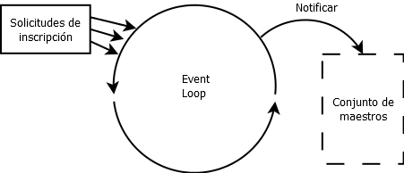

# Postwork Sesión 04: Inscripción de estudiantes

## 🎩 Objetivo 

- Aplicar los conocimientos de la programación asíncrona mediante un proyecto real.
- Practicar el uso del EventLoop, a través de su uso para implementar un sistema de registro de alumnos.

## 🎯 Requisitos 

- IntelliJ IDEA Community Edition
- JDK (o OpenJDK)
- Postwork de la sesión anterior

## 🚀 Desarrollo

El director de la escuela te ha pedido que implementes un sistema de inscripción de alumnos que notifique al maestro cuando un alumno se haya inscrito a un curso y además le muestre la cantidad de alumnos que tiene su curso, sin bloquear la plataforma para que más estudiantes puedan inscribirse al mismo tiempo.

Es por esto que han considerado que la implementación más fácil será mediante el uso de un **EventLoop** que reciba la información del alumno y el curso al que se quiere inscribir, notificando en un **worker** al maestro de la inscripción.

Tu tarea consiste en implementar el EventLoop necesario para esta plataforma, así como el worker que notifique al maestro.

El diagrama 1 muestra cómo sería el flujo del EventLoop

 

Completa las siguientes instrucciones para completar tu cuarto postwork:

1. Utiliza el proyecto de postwork 3.

2. Crea un nuevo package con el nombre de **async** 

3. Genera el modelo **SolicitudEstudiante** el cual tendrá:

    - Constructor para recibir Estudiante y Curso.

    - Métodos get y set tanto para Estudiante como para Curso.

4. Crea la interfaz **NotificadorInscripcion**, la cual notificará al maestro cada que se reciba una solicitud.

5. Genera la clase **ReceptorSolicitudes** “Debe implementar de Runnable” la cual se encargará de:

    - Procesar y esperar las solicitudes dentro del **run()**.

    - Iniciar y detener la ejecución. “Cada uno en su método correspondiente”.

    - Agregar nuevas solicitudes a la lista.

    - Retornar si se encuentra en ejecución. “A través de un método”.

6. Crea la clase InscripcionAlumnos “Contendrá el main” la cual se encargará de generar:

    - Cursos (Por lo menos cuatro).

    - Estudiantes (Por lo menos veinte).

7. **InscripcionAlumnos** deberá agregar las solicitudes, con sus respectivos estudiantes y cursos. además notificar con un **event Loop** cuando:

    - Un alumno se inscribe a un curso.

    - En un worker al maestro de que se realizó dicha inscripción.

 

## ✅ Checklist 

Asegúrate que tu postwork contenga todo lo siguiente, ya que esto se evaluará al término del módulo.

- [ ] SolicitudEstudiante recibe Estudiante y Curso en su constructor, además tiene sus get() y set().

- [ ] NotificadorInscripcion es una interfaz y tiene un método para notificar.

- [ ] ReceptorSolicitudes puede agregar solicitudes a una lista, retornar el estado de la ejecución así como iniciar y detener la ejecución.

- [ ] InscripcionAlumnos genera y agrega por lo menos cuatro cursos y veinte estudiantes

- [ ] InscripcionAlumnos notifica con un eventLoop y worker cada que un alumno se inscribe a un curso y al maestro que se realizó la inscripción.

 
 

[Regresar ](../Readme.md)(Sesión 04)

[Siguiente ](../../Sesion-05/Readme.md)(Sesión 05)