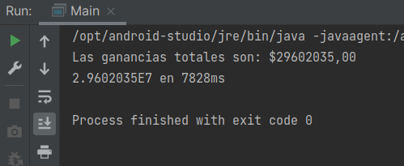

# Reto 01: Cálculo de las ganancias diarias para un conjunto de franquicias

## Objetivo
- Aplicar el procesamiento paralelo para acelerar el cálculo de la suma del total de ganancias obtenidas por una cadena de restaurantes en todas sus sucursales.

## Requisitos
- IntelliJ IDEA Community Edition
- JDK (o OpenJDK)

## Desarrollo
Una conocida cadena de hamburguesas quiere realizar cambios en su infraestructura empleando el procesamiento paralelo para acelerar el cálculo de las ganancias diarias, sumando las ganancias obtenidas por cada una de sus sucursales, las cuales tienen un identificador numérico del 0 al 1000.
El tiempo que toma obtener la información de cada sucursal es de 50ms, que deberás simular mediante un sleep en el método que te permita obtener la información de esa sucursal.
Las ganancias esperadas para una sucursal promedio van desde los $10000 hasta los $50000.

Este reto consiste en simular la implementación de este sistema, generando una clase **CadenaRestaurantes** que contenga un método **obtenerGananciasFranquicia**, que retornará el valor numérico con las ganancias del día para el id presentado. Puedes basarte en el proyecto creado para la lectura de los sensores, pero la función será ahora una suma en lugar del promedio de los valores.

<br/>

<details>
	<summary>Solución</summary>
	
 1. Dentro de la clase **CadenaRestaurantes**, en el método **obtenerGananciasFranquicia** coloca un sleep de 50ms y después de este retorna un número aleatorio acotado entre 10000 y 50000, para ello puedes usar la función Math.random multiplicada por 10000 y finalmente ese valor multiplicado por un número aleatorio entre 1 y 5.

	```java
	private Random rnd = new Random();

    public double obtenerGananciasFranquicia(int id){
        try {
            TimeUnit.MILLISECONDS.sleep(50);
        } catch (InterruptedException e) {
            e.printStackTrace();
        }

        return rnd.nextInt(40000) + 10000;
    }
	```
	
 2. Para el cálculo de la suma en lugar del promedio, puedes basarte en la implementación de **obtenerPromedio** creada durante el ejemplo 1 y realizar el cambio en el método mapToDouble, en lugar de llamar al método average se empleará el método sum y nos dará la suma de los valores contenidos en el Stream que se obtienen de nuestra **CadenaRestaurantes**.

	```java
    private static void obtenerSuma(Stream<Integer> ids) {
        LocalTime inicio = LocalTime.now(); //registramos el tiempo de inicio
        double suma = ids.mapToDouble(id -> new CadenaRestaurantes()
                        .obtenerGananciasFranquicia(id))
                .sum();
        System.out.printf("Las ganancias totales son: $%5.2f%n", suma);
        Duration tiempo = Duration.between(inicio, LocalTime.now());    //registramos el tiempo de fin
        System.out.println((Math.round(suma * 100.) / 100.) + " en " + tiempo.toMillis() + "ms"); //imprimimos el resultado
	```

3. No olvides realizar los cambios en la creación de la lista de ids para que ahora coincida con los 1000 restaurantes que se estarán controlando.

	```java
    List<Integer> ids = IntStream.range(0, 1000)
                .boxed()
                .collect(Collectors.toList());
        obtenerSuma(ids.parallelStream());  //procesamiento paralelo
	```

4. Ejecuta el proyecto. Observa los resultados.

	

</details>


<br/>
<br/>

[Siguiente ](../Ejemplo-02/Readme.md)(Ejemplo 2)