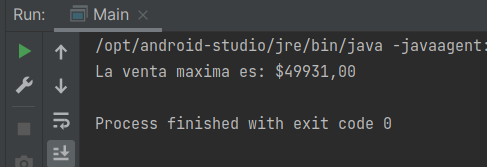

# Reto 02: Buscando las ganancias máximas obtenidas por una cadena de restaurantes

## Objetivo
- Aplicar el uso de la clase CompletableFuture para buscar el valor máximo en el conjunto de franquicias empleado en el reto 1.

## Requisitos
- IntelliJ IDEA Community Edition
- JDK (o OpenJDK)
- Reto 01

## Desarrollo
El dueño de la cadena de restaurantes te ha pedido que ahora le ayudes a encontrar el valor máximo obtenido por las ventas de sus sucursales, solo que ahora tienes que emplear la clase **CompletableFuture** para buscar dicho valor y retornarlo.

Tendrás que trabajar sobre el proyecto que creaste en el reto 1 y realizar las adaptaciones necesarias para usar la clase **CompletableFuture** de la API Future.

<br/>

<details>
	<summary>Solución</summary>
	
 1. Crea una lista de **CompletableFuture** que contenga uno para cada una de las sucursales que forman la cadena. Puedes basarte en el ejemplo 2 y realizar los cambios necesarios.

 	```java
	List<CompletableFuture<Double>> futuros = ids.stream()
		.map(id -> CompletableFuture.supplyAsync(() -> new CadenaRestaurantes().obtenerGananciasFranquicia(id)))
		.collect(Collectors.toList());
	```

 2. Cambia el método donde recibes el stream de los valores leídos de los CompletableFuture, cambiando la función sum por la función max para obtener el valor correcto para este caso.

 	```java
	OptionalDouble maximo = futuros.stream()
                .mapToDouble(CompletableFuture::join)
                .max();

	if (maximo.isPresent()) {
		System.out.printf("Las ganancias totales son: $%5.2f%n", maximo.getAsDouble());
	} else {
		System.out.print("Error");
	}
	```

3. Ejecuta el proyecto y comprobamos el resultado esperado.

	


</details>


<br/>
<br/>

[Siguiente ](../Ejemplo-03/Readme.md)(Ejemplo 3)