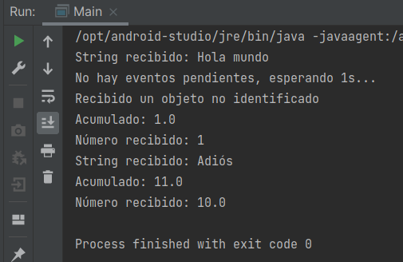

# Reto 03: Adaptando el event loop

## Objetivo
- Modificar un event loop ya existente para realizar tareas diferentes a las planeadas originalmente

## Requisitos
- IntelliJ IDEA Community Edition
- JDK (o OpenJDK)
- Ejemplo 3

## Desarrollo
Basándote en el event loop desarrollado durante el ejemplo 3, ahora tendrás que realizar las modificaciones necesarias en su **event handler** para que cuando reciba un número, vaya acumulando el valor recibido e imprima en consola el valor actual que lleva acumulado. 

También deberás agregar una condición que imprima el mensaje "Recibido un objeto no identificado" si el evento recibido no es un String o un Number.

<br/>

<details>
	<summary>Solución</summary>
	
1. Agrega la variable acumulador en la clase **EventLoopSimple**.

  	```java
    private static double acumulador;
    ```
	
 2. Dentro del **while** comprueba si evento es un número, si es así suma e imprime el valor.

  	```java
    } else if(evento instanceof Number) {
      acumulador += ((Number) evento).doubleValue();
      System.out.println("Acumulado: " + acumulador);
    }
    ```

3. En el método iniciar agrega el valir inicial del acumulador.

  	```java
    acumulador = 0;
    ```

4. En el método iniciar agrega el valir inicial del acumulador.

  	```java
    acumulador = 0;
    ```

5. Ahora en el **main**, agrega el else en caso de que no se aun número ni un string.

  	```java
    } else {
      System.out.println("Recibido un objeto no identificado");
    }
    ```

6. Ejecuta el proyecto.

    

</details>


<br/>
<br/>

[Siguiente ](../Postwork/Readme.md)(Postwork)