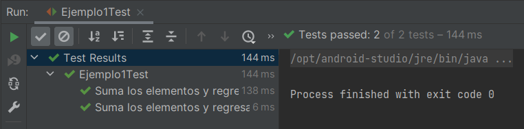

# Ejemplo 01: Usando las interfaces de RxJava

## Objetivos
* Familiarizarnos con algunas de las interfaces de RxJava

## Requisitos
- Apache Maven 3.8.4 o superior
- JDK (o OpenJDK)

<br/>

La programación reactiva es un paradigma de programación enfocado al manejo de flujos de  datos asíncronos y al uso eficiente de recursos cuyos principales objetivos son:

1. Propagar los cambios en un sistema requiriendo la menor cantidad de esfuerzo.
2. Hacer más sencillo el trabajar con flujos asíncronos de datos.

En cuanto a los beneficios de la programación reactiva tenemos:

- **Escabilidad**. Implementación débilmente acoplada, escalable y que tiende a aislar fallos. La escalabilidad se refiere a la propiedad de aumentar la capacidad de trabajo o de tamaño de un sistema sin comprometer el funcionamiento y calidad normales del sistema. 
- **Ahorro**. Ofrece hacer más con menos, en específico para procesar cargas de trabajo más altas con menos hilos. Esto permite el uso eficiente de los recursos lo que significa gastar menos dinero en servidores.


<br/>

## Maven

Para ejecutar las pruebas de maven usa:
```bash
mvn test
```

## Procedimiento

1. Descarga el código del [ejemplo 1](./codigo/)

2. Crea la clase Ejemplo1 en el paquete `org.bedujse.demo.reactive.ejemplo1`

3. Define los siguientes métodos vacíos.

    ```java
    static  Single<Integer> sumarSingle(){
        return null;
    }

    static Integer sumar(){
        return null;
    }
    ```

4. Crea una prueba para la clase Ejemplo1

    
  
5. Agrega el siguiente código

    ```java
    @Test
    @DisplayName("Suma los elementos y regresa Single")
    void sumaElementos() {
        Ejemplo1.sumarSingle()
                .subscribe(s -> assertThat(s).isEqualTo(21));
    }

    @Test
    @DisplayName("Suma los elementos y regresa valor (bloqueante)")
    void sumaElementosBloqueante() {
        assertThat(Ejemplo1.sumar()).isEqualTo(21);
    }
    ```

    Si ejecutas la prueba en este momento obtendrás un error ya que estamos regresando `null`.

    


6. Reemplaza el código de la clase de la siguiente manera:

    **RxJavaObservableGenerator** es una clase que genera un observable a partir de una lista de números del 1 al 6.

    ```java
    static  Single<Integer> sumarSingle(){
        return RxJavaObservableGenerator
                .observableStream()
                .reduce(0,(a,b) -> a + b);
    }

    static Integer sumar(){
        return RxJavaObservableGenerator
                .observableStream()
                .reduce(0,(a,b) -> a + b)
                .blockingGet();
    }
    ```

7. Vuelve a ejecutar la prueba

    Nota que estamos usando programación funcional para reducir el conjunto de enteros a su suma. El resultado de `.reduce` es un `Single<Integer>`. En el primer método regresamos ese objeto y en la prueba usamos `.subscribe` para hacer la acerción.

    En el segundo caso usamos `.blockingGet` el cual bloquea el hilo y arroja el resultado una vez que se tiene.

    Recuerda que debes pensar dos veces antes de usar una operación bloqueante.

    

<br/>

¡Felicidades! Completaste el primer ejemplo.

<br/>

[Siguiente ](../Reto-01/Readme.md)(Reto 1)