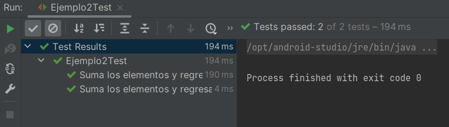

# Ejmplo 02: Usando las interfaces de Project Reactor

## Objetivos
* Familiarizarnos con algunas de las interfaces de Project Reactor

## Requisitos
- Apache Maven 3.8.4 o superior
- JDK (o OpenJDK)

## Maven

Para ejecutar las pruebas de maven usa:
```bash
mvn test
```

## Procedimiento

1. Crea la clase Ejemplo2 en el paquete `org.bedujse.demo.reactive.ejemplo1`

2. Define los siguientes métodos vacíos.

    ```java
    static  Mono<Integer> sumarSingle(){
        return null;
    }

    static Integer sumar(){
        return null;
    }
    ```

3. Crea una prueba para la clase Ejemplo2
  
    

4. Agrega el siguiente código

    ```java
    @Test
    @DisplayName("Suma los elementos y regresa Single")
    void sumaElementos() {
        Ejemplo2.sumarSingle()
                .subscribe(s -> assertThat(s).isEqualTo(21));
    }

    @Test
    @DisplayName("Suma los elementos y regresa valor (bloqueante)")
    void sumaElementosBloqueante() {
        assertThat(Ejemplo2.sumar()).isEqualTo(21);
    }
    ```

    Si ejecutas la prueba en este momento obtendrás un error ya que estamos regresando `null`.

5. Reemplaza el código de la clase de la siguiente manera

    **RxJavaObservableGenerator** es una clase que genera un observable a partir de una lista de números del 1 al 6.

    ```java
    static  Single<Integer> sumarSingle(){
       return ReactorFluxGenerator
               .fluxStream()
               .reduce(0,(a,b) -> a + b);
    }

    static Integer sumar(){
       return ReactorFluxGenerator
               .fluxStream()
               .reduce(0,(a,b) -> a + b)
               .block();
    }
    ```

6. Genera la clase **ReactorFluxGenerator**

    ```java
    import reactor.core.publisher.Flux;

    public class ReactorFluxGenerator {
        private static final Integer[] LISTA = {1,2,3,4,5,6};

        public static Flux<Integer> fluxStream(){
            return Flux.fromArray(LISTA);
        }
    }
    ```

7. Vuelve a ejecutar la prueba

    Este ejemplo es esencialmente igual al Ejemplo 1, sólo cambian las interfaces usadas (Flux y Mono vs Observable y Single) y el método bloqueante (`.block` vs `.blockingGet`)

    **RxJava** y Project Reactor tienen algunas diferencias en cuanto a capacidades y funcionalidades, pero ambas son herramientas poderosas para crear sistemas reactivos.


    


<br/>

[Siguiente ](../Reto-02/Readme.md)(Reto 2)