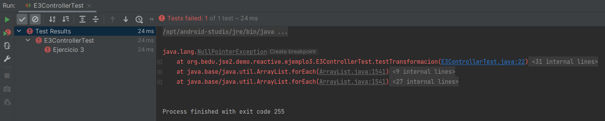
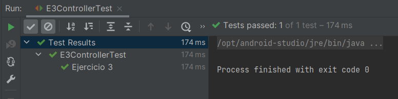

# Ejemplo 03: Modificando un Flux en un servicio intermedio

## Objetivos
* Aprender a usar servicios intermedios no bloqueantes

## Requisitos
- Apache Maven 3.8.4 o superior
- JDK (o OpenJDK)

## Maven

Para ejecutar las pruebas de maven usa:
```bash
mvn test
```

## Procedimiento

1. En el código del ejemplo 3 existe una arquitectura de tres capas (controlador - servicio - repositorio). En este ejercicio sólo debes modificar la clase E3Service 

2. Ejecuta la prueba para saber qué es lo que se espera.

    

3. Agrega el siguiente código a E3Service

    ```java
    public Flux<String> getListaNombre(){
        return REPOSITORY
                .getPersonas()
                .map(this::formatearNombre);
    }

    private String formatearNombre(PersonaEntity persona){
        return String.format("%s %s, %s", persona.getPrimerApellido(), persona.getSegundoApellido(), persona.getNombre());
    }
    ```

4. Vuelve a ejecutar la prueba

    

    En este ejemplo aprendimos a manipular un Flux sin necesidad de bloquearlo. Recuerda que debemos evitar bloquar hilos no-bloqueantes para poder mantener la responsividad del sistema.

    Toma en cuenta que, aunque la arquitectura en tres capas es muy común, en este caso se simplificó su uso, esto es, este no es un ejemplo real.


<br/>

[Siguiente ](../Reto-03/Readme.md)(Reto 3)