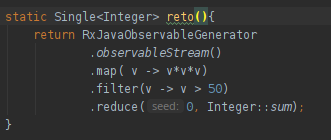

# Reto 01

## Objetivos

- Reafirmar la comprensión de las interfaces RxJava 
- Reafirmar el conocimiento de programación funcional

## Requisitos
- IntelliJ IDEA Community Edition
- JDK (o OpenJDK)

En el Ejercicio 1 partimos de un objeto `Observable<Integer>` para obtener su suma.

En esta ocasión debemos elevar al cubo cada elemento y sumar sólo los que sean mayores a 50.

<br/>

<details>
  <summary>Solución</summary>

1. Agrega una nueva prueba como se muestra

   ```java
   @Test
   @DisplayName("Reto 1")
   void cubosFiltrados(){
      Ejemplo1.reto().subscribe(s -> assertThat(s).isEqualTo(405));
   }
   ```

   
   

2. Agrega el siguiente método a la clase Ejemplo1

   ```java
   static Single<Integer> reto(){
      return RxJavaObservableGenerator
         .observableStream()
         .map( v -> v*v*v)
         .filter(v -> v > 50)
         .reduce(0, Integer::sum);
   }
   ```

   

3. Vuelve a ejecutar la prueba

   Al igual que en programacion funcional común, podemos hacer uso de `.map` y `.filter`.

   


</details>


<br/>
<br/>

[Siguiente ](../Ejemplo-02/Readme.md)(Ejemplo 02)