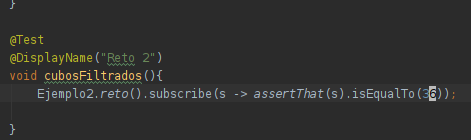
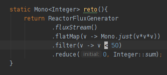
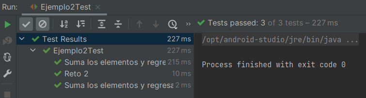

# Reto 2

## Objetivos
* Reafirmar la comprensión de las interfaces Project Reactor 
* Reafirmar el conocimiento de programación funcional

## Requisitos
- IntelliJ IDEA Community Edition
- JDK (o OpenJDK)

En el Ejercicio 2 partimos de un objeto Flux<Integer> para obtener su suma.

En esta ocasión debemos elevar al cubo cada elemento y sumar sólo los que sean menores a 50.

## Restricciones:

- usa flatMap en vez de map


<br/>

<details>
  <summary>Solución</summary>

   1. Agrega una nueva prueba como se muestra
      
      

      ```java
      @Test
      @DisplayName("Reto 2")
      void cubosFiltrados(){
         Ejemplo2.reto().subscribe(s -> assertThat(s).isEqualTo(36));
      }
      ```
   
   2. Agrega el siguiente método a la clase Ejemplo1
   
      

      ```java
      static Mono<Integer> reto(){
         return ReactorFluxGenerator
            .fluxStream()
            .flatMap(v -> Mono.just(v*v*v))
            .filter(v -> v < 50)
            .reduce(0, Integer::sum);
      }
      ```
   
   3. Vuelve a ejecutar la prueba

      

   .flatMap tiene dos casos de uso generales:

   - Cuando se desea procesar el stream/flux en paralelo
   
   - Cuando cada valor puede generar varios valores más (expansion de la lista)

   Ten en cuenta que flatMap procesa en paralelo, por lo que el resultado final debe ser independiente del orden de ejecución de las operaciones/funciones (deben ser funciones puras).


</details>


<br/>
<br/>

[Siguiente ](../Ejemplo-03/Readme.md)(Ejemplo 03)