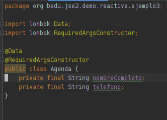
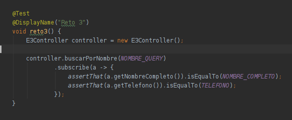
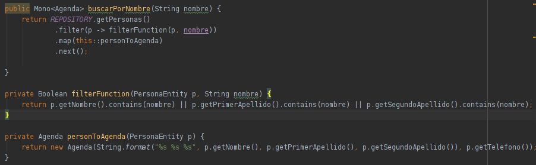
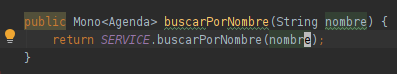

# Reto 3

## Objetivos

* Reafirmar el conocimiento de programación reactiva con servicios intermedios.

## Requisitos
- IntelliJ IDEA Community Edition
- JDK (o OpenJDK)

<br/>

En el Ejercicio 3 usamos un servicio intermedio para transformar un Flux<PersonaEntity> en un Flux<String>.

En esta ocasión nos piden que la salida tenga el nombre completo y el teléfono de una persona dado su nombre o uno de sus apellidos.

Crea una nueva clase Agenda con el nombre completo y el número y haz que devuelva un Flux<Agenda>

<br/>

<details>
  <summary>Solución</summary>

   1. Crea la calse Agenda
   
      

      ```java
      @Data
      @RequiredArgsConstructor
      public class Agenda {
         private final String nombreCompleto;
         private final String telefono;
      }
      ```
   
   2. Agrga el siguiente caso de prueba
   
      

      ```java
      @Test
      @DisplayName("Reto 3")
      void reto3() {
         E3Controller controller = new E3Controller();

         controller.buscarPorNombre(NOMBRE_QUERY)
            .subscribe(a -> {
               assertThat(a.getNombreCompleto()).isEqualTo(NOMBRE_COMPLETO);
               assertThat(a.getTelefono()).isEqualTo(TELEFONO);
            });
      }
      ```
   
   3. En el servicio agrega el código que filtre y transforme los resultados
   
      

      ```java
      public Mono<Agenda> buscarPorNombre(String nombre) {
         return REPOSITORY.getPersonas()
            .filter(p -> filterFunction(p, nombre))
            .map(this::personToAgenda)
            .next();
      }

      private Boolean filterFunction(PersonaEntity p, String nombre) {
         return p.getNombre().contains(nombre) || p.getPrimerApellido().contains(nombre) || p.getSegundoApellido().contains(nombre);
      }

      private Agenda personToAgenda(PersonaEntity p) {
         return new Agenda(String.format("%s %s %s", p.getNombre(), p.getPrimerApellido(), p.getSegundoApellido()), p.getTelefono());
      }
      ```
   
   4. Finalmente, en el controlador agrega la llamada al servicio
   
      

      ```java
      public Mono<Agenda> buscarPorNombre(String nombre) {
         return SERVICE.buscarPorNombre(nombre);
      }
      ```

      El método .next nos permite tomar el primer elemento de un Flux y reducirlo a un Mono

</details>


<br/>
<br/>

[Siguiente ](../Postwork/Readme.md)(Postwork)