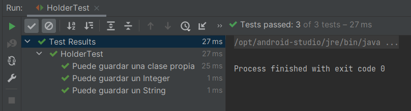

# Ejemplo 01: Clases Genéricas

## Objetivos

* Crear una clase que use _Generics_ para comprender su uso.

## Requisitos

- Apache Maven 3.8.4 o superior
- JDK (o OpenJDK)

## Procedimiento

1. Crea un nuevo proyecto con el siguiente pom.xml

    ```xml
    <?xml version="1.0" encoding="UTF-8"?>
    <project xmlns="http://maven.apache.org/POM/4.0.0"
            xmlns:xsi="http://www.w3.org/2001/XMLSchema-instance"
            xsi:schemaLocation="http://maven.apache.org/POM/4.0.0 http://maven.apache.org/xsd/maven-4.0.0.xsd">
        <modelVersion>4.0.0</modelVersion>

        <groupId>org.bedu.jse2</groupId>
        <artifactId>generics</artifactId>
        <version>1.0-SNAPSHOT</version>

        <properties>
            <maven.compiler.source>11</maven.compiler.source>
            <maven.compiler.target>11</maven.compiler.target>
            <project.build.sourceEncoding>UTF-8</project.build.sourceEncoding>
        </properties>

        <dependencies>
            <dependency>
                <groupId>org.junit.jupiter</groupId>
                <artifactId>junit-jupiter-api</artifactId>
                <version>5.5.2</version>
                <scope>test</scope>
            </dependency>
        </dependencies>

        <build>
            <plugins>
                <plugin>
                    <groupId>org.apache.maven.plugins</groupId>
                    <artifactId>maven-surefire-plugin</artifactId>
                    <version>2.22.2</version>
                </plugin>
            </plugins>
        </build>
    </project>
    ```

2. Agrega una clase Holder en el paquete org.bedu.jse2.generics con el siguiente contenido:

    ```java
    package org.bedu.jse2.generics;

    public class Holder<E> {

        private E object;

        void hold(E object){
            this.object = object;
        }

        E release(){
            return object;
        }
    }
    ```

3. Crea una clase de prueba para la clase con el siguiente contenido inicial
    
    ```java
    package org.bedu.jse2.generics;

    import static org.junit.jupiter.api.Assertions.*;

    class HolderTest {

        private class ClasePropia {
            private  final String nombre;
            private final Integer edad;

            ClasePropia(String nombre, Integer edad){
                this.nombre = nombre;
                this.edad = edad;
            }

            public String getNombre(){
                return nombre;
            }

            public Integer getEdad(){
                return edad;
            }
        }
    }
    ```

4. Agrega una primera prueba para validar que nuestra clase puede almacenar un entero.
    
    ```java
    @Test
    @DisplayName("Puede guardar un Integer")
    void entero(){
        Integer entero = 123;
        Holder<Integer> holder = new Holder<>();
        holder.hold(entero);

        assertEquals(entero, holder.release());
    }
    ```
5. Agrega una prueba para validar que nuestra clase puede almacenar un string.

    ```java
    @Test
    @DisplayName("Puede guardar un String")
    void string(){
        String str = "Hola mundo";
        Holder<String> holder = new Holder<>();
        holder.hold(str);

        assertEquals(str, holder.release());
    }
    ```

6. Agrega una prueba para validar que nuestra clase puede almacenar nuestra clase propia.

    ```java
    @Test
    @DisplayName("Puede guardar una clase propia")
    void custom(){

        ClasePropia cp = new ClasePropia("Juan", 20);

        Holder<ClasePropia> holder = new Holder<>();
        holder.hold(cp);

        assertEquals(cp.getNombre(), "Juan");
        assertEquals(cp.getEdad(), 20);
    }
    ```

    

<br/>

¡Felicidades! Completaste el primer ejemplo.

<br/>

[Siguiente ](../Reto-01/Readme.md)(Reto 1)