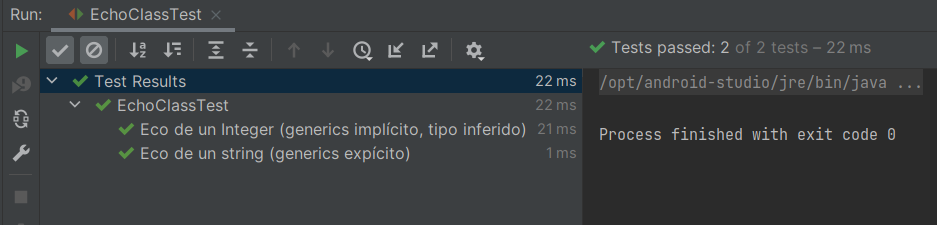

# Ejemplo 02: Métodos Genéricos

## Objetivos

* Crear un método que use _Generics_ para comprender su uso.

## Requisitos

- Apache Maven 3.8.4 o superior
- JDK (o OpenJDK)

## Procedimiento

1. Crea una nueva clase con el siguiente contenido

    ```java
    package org.bedu.jse2.generics;

    public class EchoClass {

        public static <E> E echo(E input){
            return input;
        }
    }
    ```

2. Crea una clase de prueba para la clase, y agrega esta primera prueba

    ```java
    @Test
    @DisplayName("Eco de un string (generics expícito)")
    void echoString() {
        String input = "Hola mundo";
        String output = EchoClass.<String>echo(input);

        assertEquals(input, output);
    }
    ```

    En este caso, al ejecutar el método echo, definimos explícitamente el tipo parametrizado del método (String).

3. Agrega la siguiente prueba

    ```java
    @Test
    @DisplayName("Eco de un Integer (generics implícito, tipo inferido)")
    void echoInteger() {
        Integer input = 85549;
        Integer output = EchoClass.echo(input);

        assertEquals(input, output);
    }
    ```

    En este caso al ejecutar el método echo dejamos que el compilador haga la inferencia del tipo parametrizado. Para métodos genéricos es preferible usar este segunda forma.

4. Ejecuta el proyecto, comenta los resultados.

    


<br/>
<br/>

[Siguiente ](../Reto-02/Readme.md)(Reto 2)