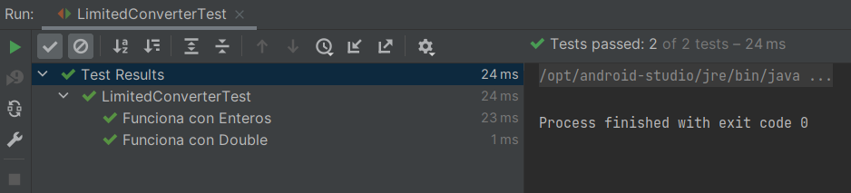

# Ejemplo 03: Clases Genéricas

## Objetivos
* Crear una clase que use _Generics_ con un límite para poder usar métodos del tipo superior.

## Requisitos

- Apache Maven 3.8.4 o superior
- JDK (o OpenJDK)

## Procedimiento

1. Crea una clase de prueba con el siguiente código

    ```java
    package org.bedu.jse2.generics;

    import org.junit.jupiter.api.DisplayName;
    import org.junit.jupiter.api.Test;

    import static org.junit.jupiter.api.Assertions.*;

    class LimitedConverterTest {

        @Test
        @DisplayName("Funciona con Enteros")
        void integers(){
            Integer numero1 = 3;
            Integer numero2 = 4;

            LimitedConverter<Integer> converter = new LimitedConverter<>();

            assertFalse(converter.esMayorQue(numero1, numero2));
        }
        
        @Test
        @DisplayName("Funciona con Double")
        void doubles(){
            Double numero1 = 3.4;
            Double numero2 = 4.7;

            LimitedConverter<Double> converter = new LimitedConverter<>();

            assertTrue(converter.esMayorQue(numero2, numero1));

        }
    }
    ```

2. Crea la clase LimitedConverter de la siguiente manera

    ```java
    package org.bedu.jse2.generics;

    public class LimitedConverter <E extends Number>{

        public boolean esMayorQue(E number1, E number2) {
            return (number1.doubleValue() - number2.doubleValue()) > 0;
        }
    }
    ```

    Al establecer el límite superior podemos usar métodos de ese tipo, en este caso .doubleValue.

3. Ejecuta las pruebas.

    

<br/>
<br/>

[Siguiente ](../Reto-03/Readme.md)(Reto 03)