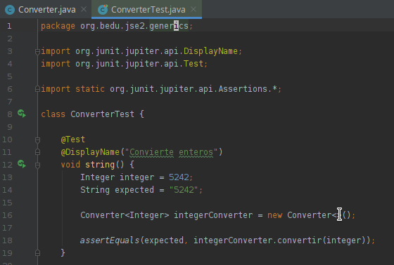
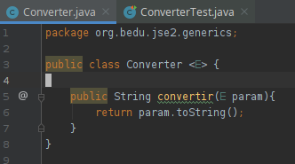
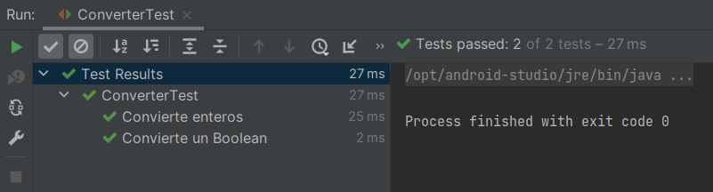

# Reto 1

## Objetivos

* Crear una clase que convierta entre dos tipos distintos

## Requisitos

- IntelliJ IDEA Community Edition
- JDK (o OpenJDK)

## Desarrollo

En el Ejercicio 1 creamos una clase que puede almacenar un objeto genérico.

Para este ejercicio crea una clase que permita convertir un objeto cualquiera a una representación de string.

<br/>

<details>
  <summary>Solución</summary>

  1. Agrega una nueva prueba como se muestra
    
      

      ```java
      @Test
      @DisplayName("Convierte enteros")
      void string() {
          Integer integer = 5242;
          String expected = "5242";

          Converter<Integer> integerConverter = new Converter<>();

          assertEquals(expected, integerConverter.convertir(integer));
      }

      @Test
      @DisplayName("Convierte un Boolean")
      void booleano() {
          Boolean aBoolean = Boolean.TRUE;
          String expected = "true";

          Converter<Boolean> integerConverter = new Converter<>();

          assertEquals(expected, integerConverter.convertir(aBoolean));
      }
      ```
  
  2. Crea una clase con la siguiente definición
    
      

      ```java
      public class Converter <E> {

        public String convertir(E param){
            return param.toString();
        }
      }
      ```
  
  3. Vuelve a ejecutar la prueba

      

  En este caso aprovechamos el método toString que está definido en la cima de la jerarquía de objetos Java (Object).

</details>


<br/>
<br/>

[Siguiente ](../Ejemplo-02/Readme.md)(Ejemplo 02)