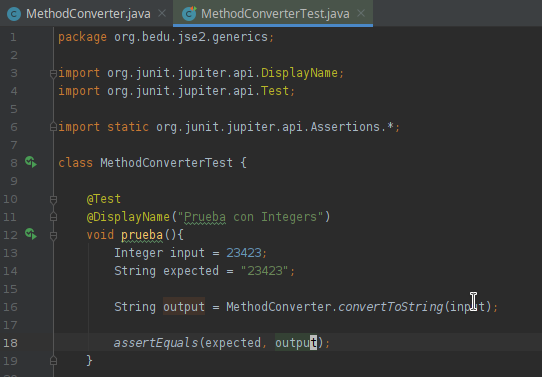
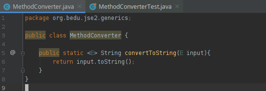
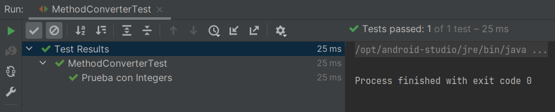

# Reto 2

## Objetivos

* Crear un método estático para convertir arbitráriamente

## Requisitos

- IntelliJ IDEA Community Edition
- JDK (o OpenJDK)

## Desarrollo

En el Ejercicio 2 creamos una clase que aprovecha el método toString de Object.

Repite este comportamiento en un método estático.

<br/>

<details>
  <summary>Solución</summary>

  1. Agrega una nueva prueba como se muestra
    
      

      ```java
      class MethodConverterTest {

        @Test
        @DisplayName("Prueba con Integers")
        void prueba(){
            Integer input = 23423;
            String expected = "23423";

            String output = MethodConverter.convertToString(input);

            assertEquals(expected, output);
        }
      }
      ```
  
  2. Crea una clase con la siguiente definición
    
      

      ```java
      public class MethodConverter {

        public static <E> String convertToString(E input){
            return input.toString();
        }
      }
      ```
  
  3. Vuelve a ejecutar la prueba

      

      En este caso aprovechamos el método toString que está definido en la cima de la jerarquía de objetos Java (Object).

</details>


<br/>
<br/>

[Siguiente ](../Ejemplo-03/Readme.md)(Ejemplo 03)