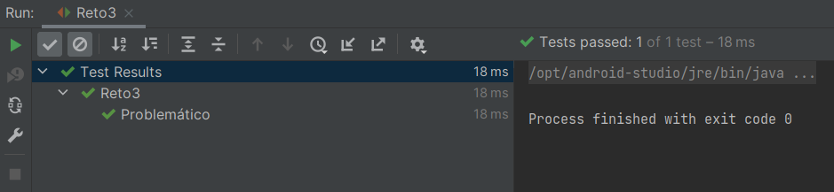

# Reto 3

## Objetivos
* Comprender las jerarquías de métodos genéricos

## Requisitos

- IntelliJ IDEA Community Edition
- JDK (o OpenJDK)

## Desarrollo

Para este ejercicio crea una jerarquía de clases genéricas, que requiera cierto tratamiento especial.

**Tip** -> 
Puedes revisar el siguiente contenido [material](https://docs.oracle.com/javase/tutorial/java/generics/inheritance.html)

<br/>

<details>
  <summary>Solución</summary>

  1. Para que el código funcione basta con establecer un límite superior al definir numList
    
      

      ```java
      public class Reto3 {
        @Test
        @DisplayName("Problemático")
        void reto(){
            List<? extends Number> numberList;

            List<Integer> integerList = List.of(1,2,3);

            numberList = integerList;

            assertNotNull(numberList);
        }
      }
      ```

      En este ejercicio creamos una jerarquía de clases genéricas, que requiere cierto tratamiento especial.

  2. Ejecuta el proyecto.

      

</details>


<br/>
<br/>

[Siguiente ](../Postwork/Readme.md)(Postwork)