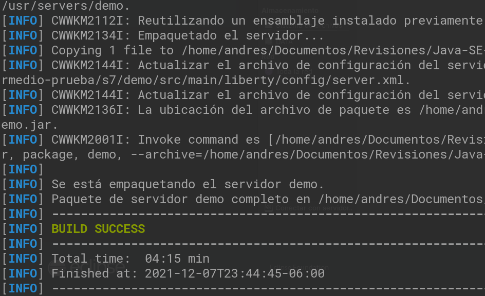

# Ejemplo 01: Usar MicroProfile para crear un microservicio

## Objetivos
* Familiarizarnos con microprofile

## Requisitos

- Apache Maven 3.8.4 o superior
- JDK (o OpenJDK)

## Procedimiento

1. Entrar a [MicroProfile Starter](https://start.microprofile.io/) 

2. Crea el proyecto demo como se muestra:

    

3. Descomprime el proyecto

4. Abrir el proyecto con su IDE preferido y compilarlo, otra opcion es compilarlo con Maven:

    ```java
    mvn clean package
    ```

    

    

5. Una vez compilado abrimos una terminal y nos colocamos en el directorio del proyecto y ejecutamos el siguiente comando:

    ```java
    java -jar target/demo.jar
    ```

    

6. Una vez que termina de correr el proceso ingresamos con el navegador a:

    http://localhost:9080/index.html

    

<br/>

¡Felicidades! Completaste el primer ejemplo.

<br/>

[Siguiente ](../Reto-01/Readme.md)(Reto 1)
