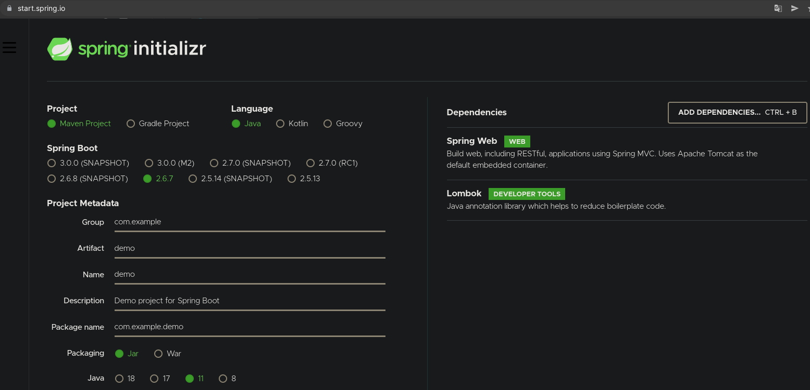
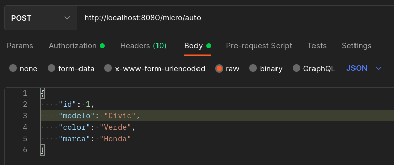
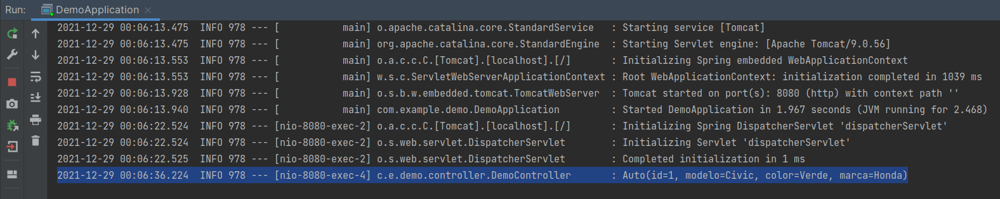

# Ejemplo 02: Usar Spring boot para crear un microservicio

## Objetivos
* Familiarizarnos con spring boot

## Requisitos
- Apache Maven 3.8.4 o superior
- JDK (o OpenJDK)
- Postman

## Procedimiento

1. Crea el proyecto con la dependencia de spring web y lombok dentro de **pom.xml**

    

2. Crear un paquete llamado "entity" el cual contenga la clase "Auto" con el siguiente codigo:

    ```java
    package com.example.demo.entity;

    import lombok.Data;

    @Data
    public class Auto {
        private int id;
        private String modelo;
        private String color;
        private String marca;
    }
    ```

    Agrega la dependencia de **lombok**

    ```xml
    <dependency>
        <groupId>org.projectlombok</groupId>
        <artifactId>lombok</artifactId>
        <version>1.18.22</version>
    </dependency>
    ```

3. Crear un paquete llamado "controller" el cual contenga la clase "DemoController" con el siguiente codigo:

    ```java
    package com.example.demo.controller;

    import com.example.demo.entity.Auto;
    import lombok.extern.slf4j.Slf4j;
    import org.springframework.web.bind.annotation.PostMapping;
    import org.springframework.web.bind.annotation.RequestBody;
    import org.springframework.web.bind.annotation.RequestMapping;
    import org.springframework.web.bind.annotation.RestController;

    @RestController
    @RequestMapping("/micro")
    @Slf4j
    public class DemoController {

        @PostMapping("/auto")
        public void recibe(@RequestBody Auto auto){
            log.info(auto.toString());
        }
    }
    ```

4. Una vez terminado lo ejecutamos, abrimos postman y colocamos la informacion como se ve en la imagen:

    


5. Damos click en Send y se mostrará en consola la informacion que enviamos.

    


<br/>
<br/>

[Siguiente ](../Reto-02/Readme.md)(Reto 2)
