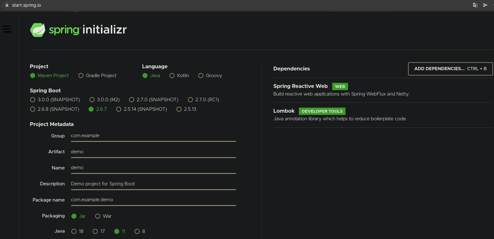
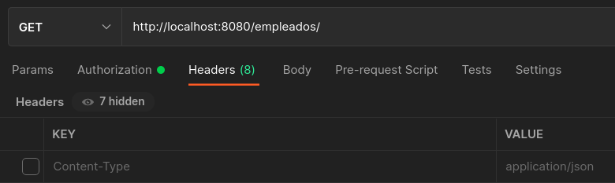
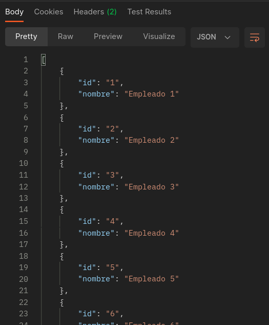

# Ejemplo 3: Usar Spring boot WebFlux para crear un microservicio

## Objetivos

* Spring boot WebFlux

## Requisitos

- IntelliJ IDEA Community Edition
- Apache Maven 3.8.4 o superior
- JDK (o OpenJDK)
- Postman

## Procedimiento

1. Crea el proyecto demo con la dependencia de spring reactive web

    

2. Descomprimir el proyecto

3. Abrir el proyecto con su IDE preferido y crear un paquete llamado "entity" el cual contenga la clase "Empleado" con el siguiente codigo:

    ```java
    import lombok.AllArgsConstructor;
    import lombok.Data;
    import lombok.NoArgsConstructor;

    @Data
    @AllArgsConstructor
    @NoArgsConstructor
    public class Empleado {

        private String id;
        private String nombre;
    }
    ```

    Agrega la dependencia de **lombok**

    ```xml
    <dependency>
        <groupId>org.projectlombok</groupId>
        <artifactId>lombok</artifactId>
        <version>1.18.22</version>
    </dependency>
    ```

4. Crear un paquete llamado "repository" el cual contenga la clase "EmpleadoRepository" con el siguiente codigo:
    
    ```java
    import com.example.demo.entity.Empleado;
    import org.springframework.stereotype.Repository;
    import reactor.core.publisher.Flux;
    import reactor.core.publisher.Mono;

    import java.util.HashMap;
    import java.util.Map;

    @Repository
    public class EmpleadoRepository {
        static Map<String, Empleado> empleadoData;

        static {
            empleadoData = new HashMap<>();
            empleadoData.put("1", new Empleado("1", "Empleado 1"));
            empleadoData.put("2", new Empleado("2", "Empleado 2"));
            empleadoData.put("3", new Empleado("3", "Empleado 3"));
            empleadoData.put("4", new Empleado("4", "Empleado 4"));
            empleadoData.put("5", new Empleado("5", "Empleado 5"));
            empleadoData.put("6", new Empleado("6", "Empleado 6"));
            empleadoData.put("7", new Empleado("7", "Empleado 7"));
            empleadoData.put("8", new Empleado("8", "Empleado 8"));
            empleadoData.put("9", new Empleado("9", "Empleado 9"));
            empleadoData.put("10", new Empleado("10", "Empleado 10"));

        }

        public Mono<Empleado> findEmpleadoById(String id) {
            return Mono.just(empleadoData.get(id));
        }

        public Flux<Empleado> findAllEmpleados() {
            return Flux.fromIterable(empleadoData.values());
        }

        public Mono<Empleado> updateEmpleado(Empleado employee) {
            Empleado existeEmpleado = empleadoData.get(employee.getId());
            if (existeEmpleado != null) {
                existeEmpleado.setNombre(employee.getNombre());
            }
            return Mono.just(existeEmpleado);
        }
    }
    ```

5. Crear un paquete llamado "controller" el cual contenga la clase "DemoController" con el siguiente codigo:

    ```java
    import com.example.demo.entity.Empleado;
    import com.example.demo.repository.EmpleadoRepository;
    import org.springframework.beans.factory.annotation.Autowired;
    import org.springframework.web.bind.annotation.GetMapping;
    import org.springframework.web.bind.annotation.RequestMapping;
    import org.springframework.web.bind.annotation.RestController;
    import reactor.core.publisher.Flux;

    @RestController
    @RequestMapping("/empleados")
    public class DemoController {

        @Autowired
        private EmpleadoRepository empleadoRepository;

        @GetMapping
        private Flux<Empleado> getAllEmpleados() {
            return empleadoRepository.findAllEmpleados();
        }
    }
    ```

6. Una vez terminado lo ejecutamos, abrimos postman y colocamos la informacion como se ve en la imagen:

    


7. Damos click en Send y observamos los resultados en el Body "Desde Postman" se mostrará la informacion que colocamos en nuestro EmpleadoRepository

    

<br/>
<br/>

[Siguiente ](../Reto-03/Readme.md)(Reto 3)