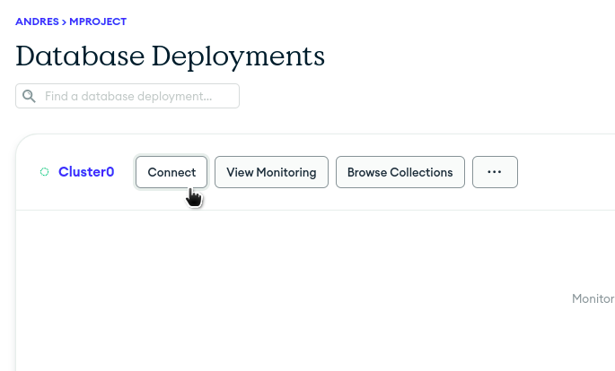
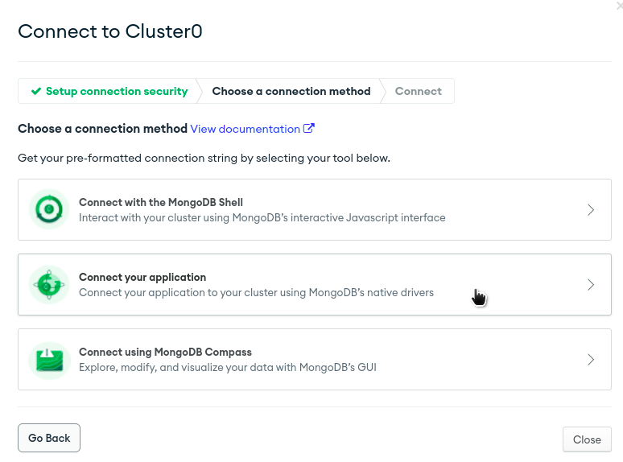
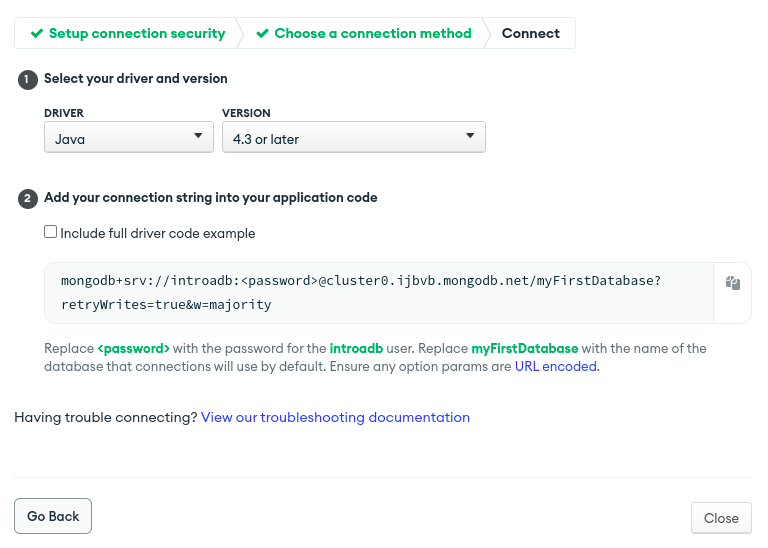
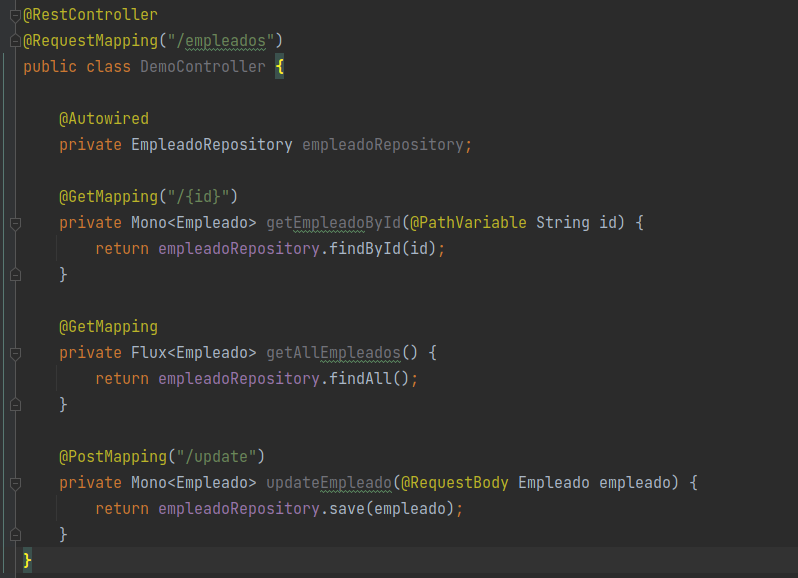
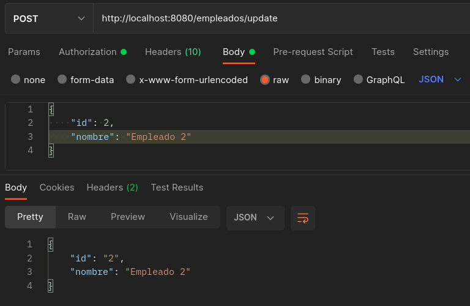
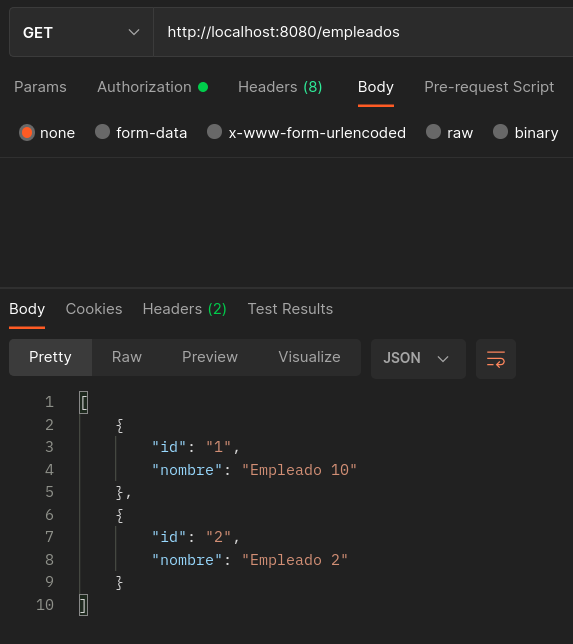
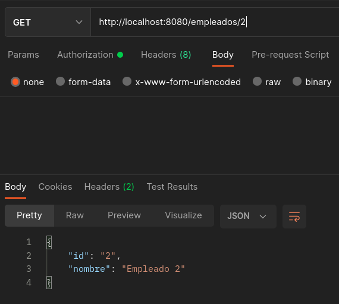
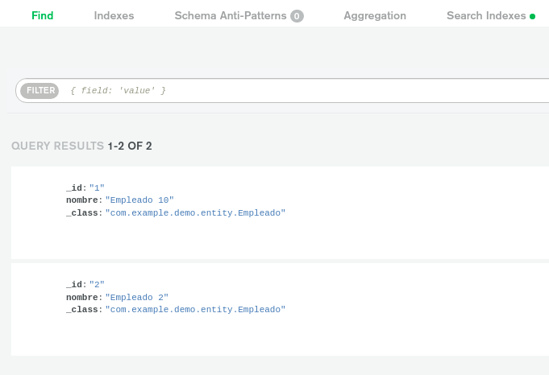

# Postwork 07: Microservicios

## 🎩 Objetivo

- Realizar microservicios a un servidor de MongoDB, para almacenar y consultar registros alojados en la base de datos.
- A lo largo de este proyecto reafirmaremos lo que se ha aprendido durante las sesiones.

## 🎯 Requisitos 

- IntelliJ IDEA Community Edition
- JDK (o OpenJDK)
- Reto 03

## 🚀 Desarrollo

**Realizar en equipo**

Completen las siguientes instrucciones para completar el séptimo postwork:

1. Clonen el proyecto del [Reto 03](../Reto-03/): 

2. En el archivo **pom** cambiar la siguiente dependencia:

    ```xml
    <dependency>
        <groupId>org.springframework.boot</groupId>
        <artifactId>spring-boot-starter-data-jpa</artifactId>
    </dependency>
    ```

    Por la siguiente:

    ```xml
    <dependency>
        <groupId>org.springframework.boot</groupId>
        <artifactId>spring-boot-starter-data-mongodb-reactive</artifactId>
    </dependency>
    ```

    **Tip** -> En caso de no encontrar la dependencia de jpa, agregar la de mongodb-reactive al inicio de las dependencias

3. Ahora ocupando una base de datos MongoDB la cual se llamará "empleado", puedes crear tu cuenta en [MongoDB Atlas](https://www.mongodb.com/atlas/database) <- Es gratis.

4. Modificamos la clase EmpleadoRepository pasarla a ser una interfaz:

    ```java
    package com.example.demo.repository;

    import com.example.demo.entity.Empleado;
    import org.springframework.data.mongodb.repository.ReactiveMongoRepository;
    import org.springframework.stereotype.Repository;

    @Repository
    public interface EmpleadoRepository extends ReactiveMongoRepository<Empleado, String>{

    }
    ```

5. Ahora generamos el uri de conexión desde MongoAtlas.

    - Damos clic en *Connect*
    

    - Después *Connect your application*
    

    - Luego seleccionamos driver Java y versión 4.3
    

    - Por último damos clic en el botón de *Copiar*

6. Agregamos el uri de conexión en el archivo **application.properties** lo encontrarás dentro de **resources**.

    ```properties
    spring.data.mongodb.uri=mongodb+srv://<user>:<password>@cluster0.ijbvb.mongodb.net/empleado?retryWrites=true&w=majority
    ```

7. Modifica el controlador con los métodos que nos devuelve la interfaz.

    

8. Por último ejecuta los tres servicios creados, notarás que ahora los datos se almacenan en MongoDB Atlas.

    - Crear empleado

        

    - Consultar empleados
    
        

    - Consultar empleado por id
    
        

    - Registros desde MongoDB Atlas

        

<br/>

## ✅ Checklist 

Asegúrate que el postwork contenga todo lo siguiente, ya que esto se evaluará al término del módulo.

- [ ] El proyecto no muestra warnings ni errores durante su ejecución.

- [ ] El proyecto logra conectarse al servidor de MongoDB.

- [ ] Es posible registrar un empleado con POST al API.

- [ ] Es posible consultar todos los empleados con GET.

- [ ] Es posible consultar un empleado por su ID con GET.


<br/>
<br/>

[Regresar ](../Readme.md)(Sesión 07)

[Siguiente ](../../Sesion-08/Readme.md)(Sesión 08)