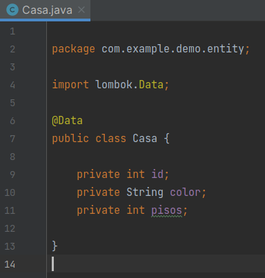
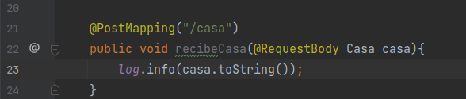
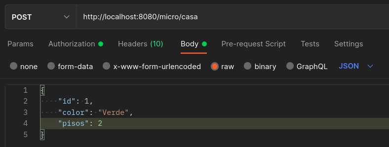
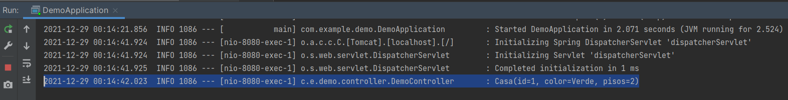

# Reto 1

## Objetivos
* Reafirmar el conocimiento de microprofile

## Requisitos

- IntelliJ IDEA Community Edition
- JDK (o OpenJDK)

## Desarrollo

En el Ejercicio 1 partimos de un proyecto el cual imprime "Hola mundo"



En esta ocasión debemos colocar una nueva ruta "/data/nuevo" en el proyecto por lo que hay que modificar la clase controller.

Y este nuevo metodo llamado "nuevo" y que mande a imprimir al navegador "Mi nuevo mensaje!".

<br/>

<details>
  <summary>Solución</summary>

1. Crea la clase NuevoController

    
  
2. Dentro de la nueva clase agrega el siguiente código:
    
    

    ```java
    @Path("/nuevo")
    @Singleton
    public class NuevoController {
        @GET
        public String sayNuevo() {
            return "Mi nuevo mensaje!";
        }
    }
    ```

3. Ejecuta los pasos del ejemplo 01.

    ```terminal
    mvn clean package
    ```

    ```terminal
    java -jar target/demo.jar
    ```

4. Vuelve a ejecutar la prueba

    Consulya la url **localhost:9080/data/nuevo**

    

</details>


<br/>
<br/>

[Siguiente ](../Ejemplo-02/Readme.md)(Ejemplo 02)