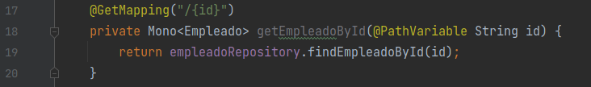

# Reto 2

## Objetivos

* Reafirmar el conocimiento de Spring boot

## Requisitos

- IntelliJ IDEA Community Edition
- JDK (o OpenJDK)

## Desarrollo

En el Ejercicio 02 partimos de un proyecto el cual recibe un Auto

Para completar este reto agrega una nuevo metodo de tipo post que reciba un objeto de tipo "Casa". 

Para esto creamos la clase con los siguientes atributos:

```java
private int id;
private String color;
private int pisos;
```

En nuestro DemoController crear el metodo con la ruta "/casa" en el proyecto y que imprima el objeto.

<br/>

<details>
  <summary>Solución</summary>

1. Crea la clase Casa dentro de entity

    

    ```java
    @Data
    public class Casa {

        private int id;
        private String color;
        private int pisos;

    }
    ```
  
2. Dentro del DemoController agrega el nuevo servicio apuntando a la entidad Casa:
    
    

    ```java
    @PostMapping("/casa")
    public void recibeCasa(@RequestBody Casa casa){
        log.info(casa.toString());
    }
    ```

3. Ejecuta el proyecto y consulta el nuevo servicio desde Postman.

    

4. Comprueba los datos desde la terminal.

    

</details>


<br/>
<br/>

[Siguiente ](../Ejemplo-03/Readme.md)(Ejemplo 03)