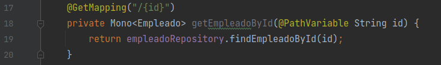
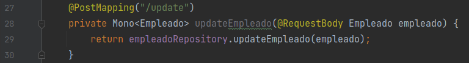
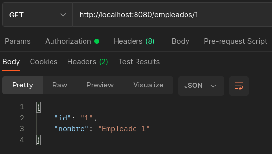
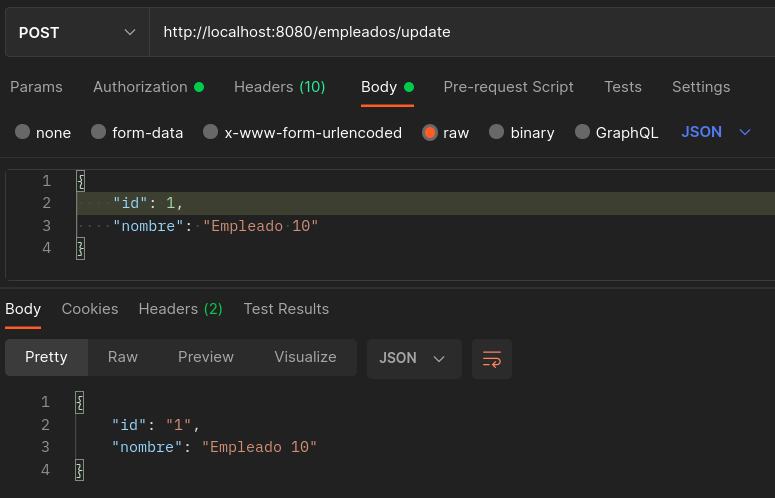

# Reto 3

## Objetivos
* Reafirmar el conocimiento de Spring webflux.

## Requisitos

- IntelliJ IDEA Community Edition
- JDK (o OpenJDK)

## Desarrollo

En el Ejercicio 3 solo ocupamos el metodo findAllEmpleados() del EmpleadoRepository.

Ahora ocuparemos los otros dos metodos:

```java
findEmpleadoById(String id)

updateEmpleado(Empleado employee)
```

El primero debera ser de tipo GET con la ruta /{id} y el segundo de tipo POST con la ruta /update.

Estos nuevos endpoint se definirán en DemoController con los nombres de metodos "getEmpleadoById" y "updateEmpleado".

<br/>

<details>
  <summary>Solución</summary>

1. Agrega el método **getEmpleadoById** al demo controller.

    

    ```java
    @GetMapping("/{id}")
    private Mono<Empleado> getEmpleadoById(@PathVariable String id) {
        return empleadoRepository.findEmpleadoById(id);
    }
    ```
  
2. Dentro del DemoController el método **updateEmpleado**.
    
    

    ```java
    @PostMapping("/update")
    private Mono<Empleado> updateEmpleado(@RequestBody Empleado empleado) {
        return empleadoRepository.updateEmpleado(empleado);
    }
    ```

3. Ejecuta el proyecto y consulta el empleado con el id 1 con GET desde Postman.

    

4. Cambia la petición a POST y el endpoint por "/empleados/update", recuerda pasar en el body el json con el id del empleado y el nuevo nombre.

    

</details>


<br/>
<br/>

[Siguiente ](../Postwork/Readme.md)(Postwork)