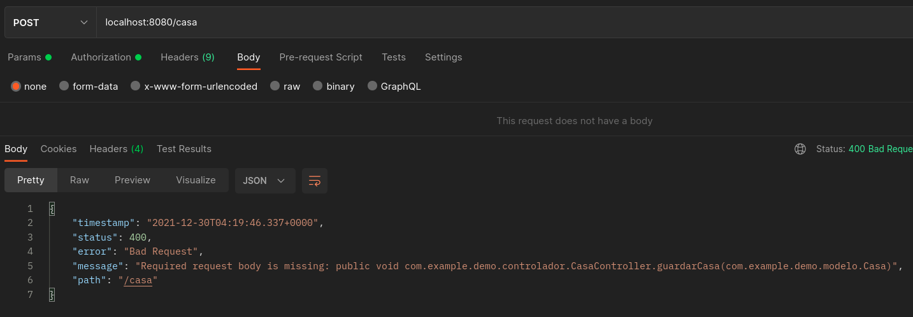
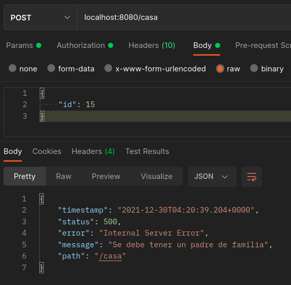
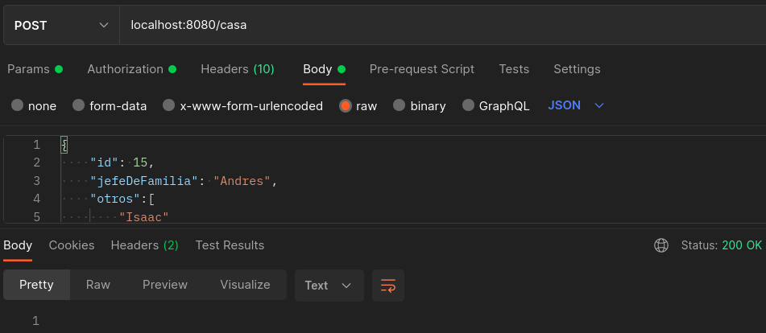

# Ejemplo 01: Refactorizacón de código

## Objetivos
* Aplicar los principios de buenas prácticas para elevar la mantenibilidad y legibilidad del código

## ⚙ Requisitos

- IntelliJ IDEA Community Edition
- JDK (o OpenJDK)

## Procedimiento

### Análisis

1. Clona el proyecto [Proyecto base](./codigo) donde encontrarás una clase llamada TodaLogica.

2. Analiza el código para identificar todo lo que está haciendo.
    
    - Por medio de las anotaciones _@RequestMapping_ está enlazando peticiones HTTP al sistema.
    - En el caso del método _guardarCasa_ está aplicando reglas de negocio (validar la existencia de un jefe de familia y pasar todos los valores a mayúsculas.
    - Usamos la clase _CasaRepository_ para interactuar con la base de datos.

3. El Principio de Responsabilidad Única tiene una variación, _Un componente [clase] debe tener una y sólo una razón de cambiar_.

  Aplicando este concepto podemos identificar al menos dos causas que requerirían modificación de nuestra clase: Si cambia la lógica de negocio o si cambia la forma de enlazar las peticiones HTTP al sistema. por lo que se recomienda hacer una refactorización.

### Refactorización

1. Crea paquetes para el controlador, las reglas de negocio, el modelo y el repositorio. Esta separación nos ayuda a tener un control en proyectos más grandes.

2. Mueve la clase _Casa_ al paquete modelo.

3. Mueve el archivo _CasaRepository_ al nuevo paquete repositorio.

4. Crea la interfaz _CasaService_ en el paquete negocio y define los dos métodos que tenemos (guardar y buscarPorId).

    ```java
    package com.example.demo.negocio;

    import com.example.demo.modelo.Casa;

    public interface CasaService {

        void guardar(Casa casa);

        Casa buscarPorId(Long id);
    }
    ```


5. Crea la clase _CasaServiceImpl_ en el paquete negocio e implementa los métodos.

    ```java
    package com.example.demo.negocio;

    import com.example.demo.modelo.Casa;
    import com.example.demo.repositorio.CasaRepository;
    import org.springframework.beans.factory.annotation.Autowired;
    import org.springframework.stereotype.Service;

    import java.util.stream.Collectors;

    @Service
    public class CasaServiceImpl implements CasaService {

        private final CasaRepository repository;

        @Autowired
        public CasaServiceImpl(CasaRepository repository) {
            this.repository = repository;
        }

        @Override
        public void guardar(Casa casa) {
            if (casa.getJefeDeFamilia() == null)
                throw new RuntimeException("Se debe tener un padre de familia");

            casa.setJefeDeFamilia(casa.getJefeDeFamilia().toUpperCase());

            casa.setOtros(casa.getOtros().stream().map(String::toUpperCase).collect(Collectors.toList()));

            repository.save(casa);
        }

        @Override
        public Casa buscarPorId(Long id) {
            return repository.findById(id).get();
        }
    }
    ```

6. Modifica la clase _TodaLogica_ para que use _CasaService_ para invocar los servicios.

7. Mueve la clase _TodaLogica_ al paquete controlador y cambia su nombre a _CasaController_ (después de todo ya no contiene toda la lógica y ya no es un nombre adecuado).

    ```java
    package com.example.demo.controlador;

    import com.example.demo.modelo.Casa;
    import com.example.demo.negocio.CasaService;
    import org.springframework.beans.factory.annotation.Autowired;
    import org.springframework.web.bind.annotation.*;

    @RestController
    @RequestMapping("/casa")
    public class CasaController {

        private final CasaService service;

        @Autowired
        public CasaController(CasaService service) {
            this.service = service;
        }

        @RequestMapping(value = "", method = RequestMethod.POST)
        public void guardarCasa(@RequestBody Casa casa) {
            service.guardar(casa);
        }

        @RequestMapping(value = "/{id}", method = RequestMethod.GET)
        public Casa getCasa(@PathVariable Long id) {
            return service.buscarPorId(id);
        }
    }
    ```

8. Como punto final, recordemos que nuestro código debe ser lo más sencillo (KISS). El método _getCasa_ recibe el valor id como String y luego debemos convertirlo a Long. Pero podemos recibirlo diréctamente como Long, dejando la conversión al framework.

### Resultado final

1. Luego de aplicar los pasos anteriores separamos el archivo TodaLogica en dos archivos, uno con cada una de las responsabilidades (causas de cambio). 

2. Creamos una interfaz y una implementación en el servicio para abrir la posibilidad de cambiar fácilmente la implementación a futuro. Esto parece una exageración en un ejemplo de este tamaño, pero para sistemas más grandes siempre se recomienda.

3. Gracias a los    paquetes, cuando busquemos hacer un cambio, podremos encontrar de manera más sencilla el archivo de interés.

    - Probando sin enviar JSON

        

    - Enviando datos incompletos

        

    - Enviando datos completos

        

<br/>

¡Felicidades! Completaste el primer ejemplo.

<br/>

[Siguiente ](../Reto-01/Readme.md)(Reto 1)