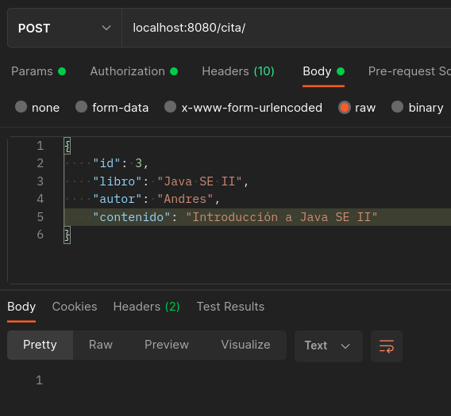

# Ejemplo 02: Refactorización de código

## Objetivos

* Aplicar los principios de buenas prácticas para elevar la mantenibilidad y legibilidad del código.

## ⚙ Requisitos

- IntelliJ IDEA Community Edition
- JDK (o OpenJDK)

## Procedimiento

### Análisis

1. Clona el proyecto [Proyecto base](./codigo) donde encontrarás una clase llamada ClaseEspaguetti.

2. Analiza el código para identificar todo lo que está haciendo.
    
    - Por medio de las anotaciones _@RequestMapping_ está enlazando peticiones HTTP al sistema.
    - En el caso del método _guardarCita_ está aplicando reglas de negocio (validar que la cita no se haya guardado previamente).
    - Usamos la clase _CitaRepository_ para interactuar con la base de datos.

3. El Principio de Responsabilidad Única tiene una variación, _Un componente [clase] debe tener una y sólo una razón de cambiar_.

    Aplicando este concepto podemos identificar al menos dos causas que requerirían modificación de nuestra clase: Si cambia la lógica de negocio o si cambia la forma de enlazar las peticiones HTTP al sistema. por lo que se recomienda hacer una refactorización.

### Refactorización

1. Crea paquetes para el controlador, las reglas de negocio, el modelo y el repositorio. Esta separación nos ayuda a tener un control en proyectos más grandes.

2. Mueve la clase _Cita_ al paquete modelo.

3. Mueve el archivo _CitaRepository_ al nuevo paquete repositorio.

4. Crea la interfaz _CitaService_ en el paquete negocio y define los dos métodos que tenemos (guardar y buscarPorId).

    ```java
    package com.example.demo.negocio;

    import com.example.demo.modelo.Cita;

    public interface CitaService {

        void guardar(Cita cita);

        Cita buscarPorId(Long id);
    }
    ```

5. Crea la clase _CitaServiceImpl_ en el paquete negocio e implementa los métodos.

    ```java
    package com.example.demo.negocio;

    import com.example.demo.modelo.Cita;
    import com.example.demo.repositorio.CitaRepository;
    import org.springframework.beans.factory.annotation.Autowired;
    import org.springframework.stereotype.Service;
    import org.springframework.web.bind.annotation.RequestMapping;
    import org.springframework.web.bind.annotation.RequestMethod;

    @Service
    public class CitaServiceImpl implements CitaService {

        private final CitaRepository repository;

        public CitaServiceImpl(CitaRepository repository) {
            this.repository = repository;
        }

        @RequestMapping(method = RequestMethod.POST)
        public void guardar(Cita cita) {

            if (repository.findAllByContenido(cita.getContenido()).size() > 0) {
                throw new RuntimeException("La cita ya fue registrada");
            }

            repository.save(cita);
        }

        @RequestMapping(method = RequestMethod.GET)
        public Cita buscarPorId(Long id) {
            return repository.findById(id).get();
        }
    }
    ```

6. Modifica la clase _ClaseEspaguetti_ para que use _CitaService_ para invocar los servicios.

7. Mueve la clase _ClaseEspaguetti_ al paquete controlador y cambia su nombre a _CitaController_ (después de todo ya no es un nombre adecuado).

    ```java
    package com.example.demo.controlador;

    import com.example.demo.modelo.Cita;
    import com.example.demo.negocio.CitaService;
    import org.springframework.beans.factory.annotation.Autowired;
    import org.springframework.web.bind.annotation.RequestMapping;
    import org.springframework.web.bind.annotation.RequestMethod;
    import org.springframework.web.bind.annotation.RestController;

    @RestController
    @RequestMapping("/cita")
    public class CitaController {

        private final CitaService service;

        @Autowired
        public CitaController(CitaService repository) {
            this.service = repository;
        }

        @RequestMapping(method = RequestMethod.POST)
        public void guardarCita(Cita cita){
            service.guardarCita(cita);
        }

        @RequestMapping(method = RequestMethod.GET)
        public Cita buscarCita(Long id){
        return service.buscarCita(id);
        }
    }
    ```

### Resultado final

1. Luego de aplicar los pasos anteriores separamos el archivo ClaseEspaguetti en dos archivos, uno con cada una de las responsabilidades (casusas de cambio). 

2. Creamos una interfaz y una implementación en el servicio para abrir la posibilidad de cambiar fácilmente la implementación a futuro. Esto parece una exageración en un ejemplo de este tamaño, pero para sistemas más grandes siempre se recomienda.

3. Gracias a los paquetes, cuando busquemos hacer un cambio, podremos encontrar de manera más sencilla el archivo de interés.

    - Registrar cita

        

    - Registrar de nuevo la misma cita

        

    - Registrar una segunda cita

        

    - Consultar la cita con el id 1

        

    - Consultar la cita con el id 2

        

<br/>
<br/>

[Siguiente ](../Postwork/Readme.md)(Postwork)